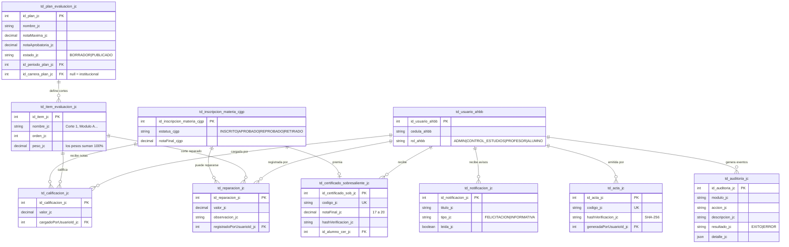

# 📊 Módulo de Control de Estudios (`_jc`) — Gestión de Notas y Actas

<div align="center">

**Tarea individual · Jean Coffi · sufijo obligatorio `_jc`**

*Planes de evaluación parametrizados · Reparaciones por corte · Actas oficiales ·
Certificados de Sobresaliente · Auditoría · RBAC*

`NestJS 11` · `TypeScript` · `Prisma ORM` · `PostgreSQL` · `Vue 3 + Quasar 2` · `JWT` · `pdfmake` · `Streams`

</div>

---

## Índice

| # | Sección | Contenido |
|---|---|---|
| 1 | [El problema y la solución](#1-el-problema-y-la-solución) | Por qué existe el módulo y qué idea lo gobierna |
| 2 | [Roles del módulo](#2-roles-del-módulo-quién-hace-qué) | Quién puede hacer qué (y quién no) |
| 3 | [Esquema de evaluación parametrizado](#3-esquema-de-evaluación-parametrizado) | Metadatos: el código no sabe cuántos cortes hay |
| 4 | [Reparaciones por corte](#4-reparaciones-por-corte) | El nuevo modelo de recuperación |
| 5 | [Carga de notas y cierre de acta](#5-carga-de-notas-y-cierre-de-acta) | La matriz dinámica y la integración con `_cjgp` |
| 6 | [Acta oficial en PDF](#6-acta-oficial-en-pdf) | pdfmake + hash SHA-256 |
| 7 | [Certificados de Sobresaliente](#7-certificados-de-sobresaliente) | Reconocimiento automático y notificación al alumno |
| 8 | [Carga masiva ETL/CSV](#8-carga-masiva-etlcsv-con-streams) | Streams de Node.js en dos fases |
| 9 | [Reportes y metadatos](#9-reportes-y-diccionario-de-datos) | Tabla temporal e `information_schema` |
| 10 | [Auditoría y RBAC](#10-auditoría-y-rbac-subsistemas-transversales) | Bitácora del sistema y consola de roles |
| 11 | [Modelo de datos (DER)](#11-modelo-de-datos-der) | Las 8 tablas del módulo |
| 12 | [Archivos del módulo](#12-archivos-del-módulo) | Qué hace cada archivo |
| 13 | [Endpoints](#13-endpoints) | Referencia de la API |
| 14 | [🧪 Ruta de prueba](#14--ruta-de-prueba-paso-a-paso) | Guion de demostración |

---

## 1. El problema y la solución

### 1.1 El problema

El sistema heredado (`_ahbb`) solo sabía de cursos libres: aprobado o reprobado, sin
más. Al incorporar **carreras con pensum** hacía falta calificar materias, y ahí
aparece el problema real: si el esquema de evaluación se programa "a lo bruto",
queda escrito en el código que hay cuatro cortes de 25 % y escala de 0 a 20. El día
que la coordinación quiera tres módulos, o cambiar los pesos, hay que reprogramar el
servidor y volver a desplegarlo.

> **Restricción del enunciado:** *"el código no debe saber cuántas notas existen;
> debe renderizar la interfaz y procesar los cálculos basándose únicamente en la
> configuración almacenada en la base de datos."*

### 1.2 La solución: Desarrollo Basado en Metadatos

La configuración se separa de la lógica. El administrador define el **Plan de
Evaluación** del período —cuántos cortes hay, cómo se llaman, cuánto pesa cada uno,
la escala y la nota aprobatoria— y todo eso son **filas en la base de datos**. El
resto del módulo se limita a leerlas.

```
  ADMIN define el plan            ->  td_plan_evaluacion_jc + td_item_evaluacion_jc
        (metadatos en la BD)                       |
                                                   v
  PROFESOR / CONTROL DE ESTUDIOS   ->  la matriz de notas se DIBUJA con esas filas
        carga las notas                            |
                                                   v
        registra REPARACIONES      ->  td_reparacion_jc  (por corte, no en el plan)
                                                   |
                                                   v
        cierra el acta             ->  definitiva = suma ponderada de los cortes
                                       (cada corte con su mejor nota)
                                                   |
                    +------------------------------+------------------------------+
                    v                              v                              v
        APROBADO / REPROBADO         Certificado de Sobresaliente        Registro en la
        en td_inscripcion_materia    (17 a 20 puntos) + notificación     bitácora de
                    |                        al alumno                   auditoría
                    v
    El MOTOR DE REGLAS de _cjgp lo lee y DESBLOQUEA las materias que dependían
```

---

## 2. Roles del módulo: quién hace qué

La ampliación introdujo el rol **`CONTROL_ESTUDIOS`**, el personal administrativo que
gestiona las calificaciones de toda la institución. Con él se redistribuyeron las
competencias:

| Acción | ADMIN | CONTROL_ESTUDIOS | PROFESOR | ALUMNO |
|---|:---:|:---:|:---:|:---:|
| Definir y publicar planes de evaluación | ✅ | — | — | — |
| Cargar y corregir notas | ❌ | ✅ | ✅ *(sus materias)* | — |
| Registrar reparaciones por corte | ❌ | ✅ | ✅ | — |
| Emitir el acta en PDF | ❌ | ✅ | ✅ | — |
| Cerrar el acta definitiva | ❌ | ✅ | ✅ | — |
| Carga masiva de calificaciones (CSV) | ❌ | ✅ | — | — |
| Consultar notas por carrera y materia | ✅ | ✅ | — | — |
| Auditoría académica | ✅ | ✅ | — | — |
| Auditoría general del sistema · RBAC | ✅ | — | — | — |
| Consultar sus propias notas y certificados | — | — | — | ✅ |

> **Decisión de diseño clave:** el **administrador dejó de poder asignar notas**.
> Configura el sistema y supervisa, pero la calificación es competencia de quien
> dicta la materia y del personal de Control de Estudios. Esto es una separación de
> funciones real, no una restricción de pantalla: los guards del backend la aplican
> y devuelven `403` aunque se llame la API con Postman.

**Diferencia entre PROFESOR y CONTROL_ESTUDIOS:** hacen exactamente lo mismo con las
notas, pero el profesor solo ve **las materias que tiene asignadas** (filtro por
`id_profesor_materia_cjgp` en la consulta) mientras que Control de Estudios ve
**todas**, y además dispone de la pantalla de auditoría académica.

📄 El catálogo de roles y la matriz de permisos viven en un único sitio:
`backend/src/common/constantes/roles_jc.ts`. Los guards, la consola de RBAC y la
normalización de roles consumen ese mismo archivo, así que la documentación de
permisos que ve el administrador **siempre coincide con lo que aplica el servidor**.

---

## 3. Esquema de evaluación parametrizado

### 3.1 Cómo funciona

- **`td_plan_evaluacion_jc`**: un plan por período académico y, opcionalmente, por
  carrera. Si `id_carrera_plan_jc` es `NULL`, el plan es **institucional** y aplica a
  todas las carreras del período — así se garantiza la **uniformidad de las actas**.
  Define la escala (`notaMaxima_jc`) y la nota aprobatoria. Estado
  `BORRADOR → PUBLICADO`: solo los publicados rigen la carga de notas.
- **`td_item_evaluacion_jc`**: cada **corte** evaluable, con nombre libre
  ("Corte 1", "Módulo A", "Parcial"), orden y peso porcentual. Los pesos deben sumar
  exactamente **100 %**.
- Un constraint `@@unique(período, carrera)` impide dos planes para el mismo alcance.

**Resolución del plan vigente** (`resolverPlanVigente_jc`): al pedir la matriz de una
materia se busca primero un plan publicado **de su carrera**; si no existe, se cae al
**institucional** del período; si no hay ninguno, se responde con un mensaje claro
("La coordinación debe configurarlo primero").

### 3.2 La fórmula de la definitiva

```
definitiva = Σ ( nota_efectiva(corte) × peso_corte / 100 )

donde  nota_efectiva(corte) = MAX( nota original , nota de reparación )
```

*Ejemplo con el plan demo (4 cortes de 25 %, escala 0–20, aprobatoria 10):*
notas 18, 19, 8, 19 → definitiva **16,00**. Se repara el Corte 3 con 18 →
definitiva **18,50 (sobresaliente)**. Si la coordinación agregara un "Corte 5" o
cambiara los pesos, **este código no cambia**: solo lee otra configuración.

📍 `backend/src/control-estudios/calificaciones.service_jc.ts` · `calcularDefinitiva_jc()`

---

## 4. Reparaciones por corte

### 4.1 Qué cambió respecto al modelo anterior

| Antes | Ahora |
|---|---|
| La "Reparación" era **un ítem más del plan** que la coordinación decidía de antemano | La reparación **no se configura en el plan**: la registra quien carga las notas |
| Existía una sola, y sustituía la **definitiva completa** si la mejoraba | Se puede reparar **cualquier corte, y tantos como haga falta** |
| El plan mezclaba cortes con peso y condiciones con peso 0 | El plan contiene **solo cortes** y sus pesos suman siempre 100 % |

### 4.2 Reglas de la reparación

- Se repara **un corte concreto** del plan vigente. Un alumno puede tener una
  reparación por cada corte.
- La nota que pondera es `MAX(nota original, nota de reparación)`: **reparar nunca
  perjudica al alumno**.
- Solo hay una reparación por alumno y corte (constraint `@@unique` en la base de
  datos); volver a registrarla actualiza el valor.
- **No se puede reparar un acta ya cerrada**: el servicio comprueba que la
  inscripción siga en estatus `INSCRITO`.
- Cada reparación guarda **quién la registró y cuándo**, y aparece en la auditoría.

### 4.3 Cómo se ve

En la matriz de notas, cada fila tiene un botón de reparación que abre un diálogo con
el corte a reparar, la nota y una observación opcional. Los cortes reparados muestran
un chip azul `R: 18` con la nota que realmente cuenta; al hacer clic en él se puede
eliminar la reparación.

El **acta en PDF** imprime la nota efectiva seguida de `(R)` y añade una nota al pie
explicando el criterio, de modo que el documento oficial refleja qué se reparó.

📍 `reparaciones.service_jc.ts` · `reparaciones.controller_jc.ts` ·
`CargaNotasView_jc.vue`

---

## 5. Carga de notas y cierre de acta

### 5.1 La matriz dinámica

El servidor devuelve un solo objeto con la materia, el período, **el plan vigente
(las columnas)** y una fila por alumno inscrito con sus notas, sus reparaciones, la
definitiva calculada y si va aprobando. La pantalla hace un `v-for` sobre los cortes
del plan: si el plan trae cinco, salen cinco columnas.

La definitiva se recalcula **en vivo** mientras el docente escribe, con la misma
fórmula del backend replicada en el cliente (duplicación consciente: la del servidor
es la que vale).

### 5.2 Validación en tres capas

| Capa | Qué comprueba |
|---|---|
| **DTO** (`class-validator`) | Tipos y rangos básicos antes de entrar al servicio |
| **Cliente** | Avisa *antes de enviar* si alguna nota se sale de la escala |
| **Servidor** | Que el corte pertenezca al plan vigente, que la inscripción sea de esa materia y período, y que el valor respete la escala. Responde `400` con la lista completa de errores |

### 5.3 El cierre del acta

`cerrarActa_jc()` es el punto donde el módulo individual alimenta al grupal:

1. Verifica que **ningún alumno tenga cortes sin nota** (ni original ni reparación);
   si falta alguno, responde nombrando a los alumnos incompletos.
2. Calcula la definitiva de cada uno con el plan vigente y las reparaciones.
3. Dentro de una transacción escribe `notaFinal_cjgp` y
   `estatus_cjgp = APROBADO | REPROBADO` en `td_inscripcion_materia_cjgp`.
4. Emite los **Certificados de Sobresaliente** de quienes cierren con 17 o más.
5. Deja el movimiento en la bitácora de auditoría con el detalle de las definitivas.

> 🔗 **La integración:** ese estatus es exactamente lo que lee
> `MotorReglasService_cjgp` para marcar una materia como aprobada y **desbloquear
> las que la tenían como prelación** en la vitrina de inscripción.

---

## 6. Acta oficial en PDF

Generada con **pdfmake** desde el servidor. Sus columnas también son dinámicas:
nacen del plan.

| Elemento | Detalle |
|---|---|
| Encabezado | Carrera, materia, créditos, período, plan de evaluación, escala y aprobatoria |
| Tabla | Una columna por corte con su peso; notas, reparaciones marcadas `(R)`, definitiva y condición coloreada |
| Pie | Código único, **hash SHA-256** y tres líneas de firma |

**Respaldo inalterable:** cada emisión calcula un hash SHA-256 del contenido
académico (materia, período, plan, cédulas y notas), lo imprime en el pie y lo
registra en `td_acta_jc` con un código único (`ACTA-2026-II-MAT1-XXXX`), quién la
generó y cuándo. Si alguien altera una nota después, al reemitir el acta el hash ya
no coincide.

> ⚠️ **El "Acta Verde" fue descontinuada.** El sistema emite una única modalidad de
> acta. La columna `tipo_jc` se conserva en la base de datos para no perder la
> trazabilidad de las actas históricas, pero toda emisión nueva es `BLANCA`.

📍 `actas.service_jc.ts`

---

## 7. Certificados de Sobresaliente

### 7.1 Qué son

Un reconocimiento a la **excelencia académica en una materia de carrera**. Se emite
**automáticamente al cerrar el acta** cuando la definitiva del alumno queda entre
**17 y 20 puntos**.

> No debe confundirse con los certificados de los **cursos libres** (`_ahbb`): son
> documentos distintos, de módulos distintos. Del certificado heredado se tomó el
> patrón técnico —pdfmake + QR verificable + registro en base de datos— pero el
> documento es propio: acredita una materia de un pensum, con su carrera, período y
> nota definitiva.

### 7.2 Qué ocurre al emitirlo

```
Se cierra el acta
   │
   ├─► definitiva >= 17  →  td_certificado_sobresaliente_jc
   │                         · código único SOB-2026-II-MAT1-V20000004-XXXX
   │                         · hash SHA-256 del contenido
   │                         · quién lo emitió
   │
   ├─► notificación de felicitación en la bandeja del alumno (td_notificacion_jc)
   │
   └─► registro en la bitácora de auditoría
```

El alumno ve la felicitación **sin recargar la página**: la vista "Mis Notas" se
refresca cada 10 segundos y muestra un banner dorado con acceso directo a su
certificado.

### 7.3 El documento

PDF horizontal con marco dorado, cintillo, los datos académicos completos, la nota
destacada, líneas de firma y un **código QR** que apunta al endpoint público de
verificación (`/certificados-sobresaliente/verificar/:codigo`), el cual devuelve
alumno, materia, carrera, período, nota y hash.

La emisión es **idempotente**: un constraint `@@unique` por inscripción impide
duplicar el certificado si el acta se vuelve a cerrar.

📍 `certificados-sobresaliente.service_jc.ts` · `notificaciones.service_jc.ts`

---

## 8. Carga masiva ETL/CSV con Streams

- **Streams de Node.js**: el archivo se procesa **línea a línea** con
  `Readable.from(buffer)` + `readline.createInterface` consumido con `for await`, de
  modo que un CSV grande nunca se carga entero en memoria. Hay un parser propio que
  respeta comillas dobles.
- **Dos fases**: `/validar` recorre todo el archivo y devuelve los errores **sin
  escribir nada**; `/confirmar` re-valida y persiste dentro de transacciones.
- Los errores indican siempre el **número de fila exacto**:
  `Fila 4: la nota "25" está fuera de la escala (0 a 20).`

| Entidad | Columnas del CSV | Validación destacada |
|---|---|---|
| `carreras` | `codigo,nombre,regimen,duracion_anios,limite_creditos,descripcion` | Régimen válido; código no duplicado |
| `materias` | `carrera_codigo,codigo,nombre,creditos,bloque,prelaciones` | La carrera debe existir; bloque dentro del rango; prelaciones resueltas en 2ª pasada |
| `planes-evaluacion` | `periodo,carrera_codigo,plan,nota_maxima,nota_aprobatoria,evaluacion,orden,peso` | **Σ de pesos = 100 %** |
| `calificaciones` | `periodo,carrera_codigo,materia_codigo,cedula,evaluacion,valor` | El corte debe existir en el plan vigente y la nota respetar su escala |

> 🔒 La entidad `calificaciones` está **reservada a Control de Estudios**: el
> administrador no asigna notas por ninguna vía, tampoco por CSV. La comprobación se
> hace en el controlador porque el permiso depende del parámetro de la ruta.

📍 `etl-csv.service_jc.ts` · plantillas en `frontend/public/plantillas/`

---

## 9. Reportes y diccionario de datos

### 9.1 Reporte de rendimiento con TABLA TEMPORAL

Dentro de una transacción interactiva de Prisma:

```sql
CREATE TEMP TABLE tmp_rendimiento_jc ON COMMIT DROP AS
SELECT m.codigo_cjgp, c.nombre_cjgp AS carrera,
       COUNT(im.*)::int AS inscritos,
       COUNT(*) FILTER (WHERE im.estatus_cjgp = 'APROBADO')::int  AS aprobados,
       COUNT(*) FILTER (WHERE im.estatus_cjgp = 'REPROBADO')::int AS reprobados,
       ROUND(AVG(im."notaFinal_cjgp"), 2)::float AS promedio
FROM td_inscripcion_materia_cjgp im JOIN ... GROUP BY ...;

SELECT *, CASE WHEN ... END AS porcentaje_aprobacion FROM tmp_rendimiento_jc;
```

`ON COMMIT DROP` garantiza que la tabla se destruya sola al terminar. El frontend la
consume por Axios y repinta la `q-table` **sin recargar la página**: es el flujo AJAX
completo (parámetro → tabla temporal → JSON → actualización del componente).

### 9.2 Consulta de notas del administrador

Pantalla de **solo lectura** que responde a "¿cómo van las notas?": se elige período y
carrera, y se obtiene una tarjeta expandible por materia con el total de alumnos,
cuántos van aprobando, cuántos en riesgo, cuántos sobresalientes y el promedio; al
desplegarla aparece la matriz completa con las reparaciones marcadas.

### 9.3 Diccionario de datos (metadatos)

`GET /planes-evaluacion/metadatos` consulta `information_schema.columns` filtrando
las tablas `%_jc` y `%_cjgp`, y la pestaña "Diccionario de Datos" de la consola las
muestra en vivo con columna, tipo, nulabilidad y posición.

---

## 10. Auditoría y RBAC: subsistemas transversales

Ambos nacieron dentro de este módulo (llevan sufijo `_jc`) pero dan servicio a
**todo el sistema**.

### 10.1 Bitácora de auditoría

Responde a *"¿quién hizo qué, cuándo y sobre quién?"*. Se alimenta de **dos fuentes
complementarias**:

| Fuente | Qué aporta |
|---|---|
| **Interceptor global** (`AuditoriaInterceptor_jc`) | Registra **toda** petición que modifica datos (`POST`, `PUT`, `PATCH`, `DELETE`), aunque su módulo no esté instrumentado. Un catálogo de reglas traduce `POST /auth/cambiar-contrasena` a "cambió su contraseña" |
| **Servicios de negocio** | Añaden el contexto que la petición HTTP no conoce: a qué alumno, en qué materia, con qué nota. Esas rutas se marcan como `delegado` para que el interceptor no duplique |

Detalles de implementación relevantes:

- **Nunca interrumpe la operación auditada**: si el registro falla, se deja
  constancia en el log del servidor y la petición del usuario continúa.
- **Nunca guarda credenciales**: los campos sensibles del cuerpo se sustituyen por
  `«oculto»` y los objetos grandes se truncan.
- Guarda **nombre y rol del autor** además de su id, para que la bitácora siga siendo
  legible aunque el usuario se elimine después.
- En el inicio de sesión todavía no hay token: se registra el **correo declarado**,
  de modo que los intentos fallidos también dejan rastro.

Dos pantallas leen la misma tabla:

| Pantalla | Rol | Alcance |
|---|---|---|
| **Auditoría Académica** | CONTROL_ESTUDIOS, ADMIN | Línea de tiempo del módulo, con el detalle de qué notas se cargaron a qué alumno |
| **Auditoría del Sistema** | ADMIN | Todo: notas, contraseñas, actas, pagos, roles… con indicadores, filtros y detalle técnico |

### 10.2 Consola de Roles y Accesos (RBAC)

El administrador crea usuarios asignándoles **contraseña y rol**, reasigna roles,
restablece contraseñas y activa o desactiva cuentas. Cada operación queda auditada
indicando quién la ejecutó y sobre quién.

Salvaguardas implementadas:

- No se puede quitar el rol al **último administrador** del sistema.
- No se admiten correo ni cédula duplicados.
- Las contraseñas se hashean reutilizando `UsuariosService.hashearContrasena_ahbb()`
  en lugar de duplicar esa lógica de seguridad.
- La **matriz de permisos** que se muestra la envía el servidor desde el mismo
  catálogo que aplican los guards: es documentación viva.

📍 `backend/src/auditoria/` · `backend/src/rbac/`

---

## 11. Modelo de datos (DER)



### Constraints que protegen reglas de negocio

| Constraint | Regla que garantiza |
|---|---|
| `@@unique(período, carrera)` en planes | **Uniformidad de las actas**: un solo plan por alcance |
| `@@unique(plan, orden)` en ítems | No hay dos cortes con el mismo orden |
| `@@unique(inscripción, ítem)` en calificaciones | Una sola nota por alumno y corte (habilita el `upsert`) |
| `@@unique(inscripción, ítem)` en reparaciones | Una sola reparación por alumno y corte |
| `@unique(inscripción)` en certificados | No se duplica el certificado al recerrar un acta |
| `@unique(codigo)` en actas y certificados | Identificadores de negocio irrepetibles |
| Cascadas `onDelete` | Borrar un plan limpia ítems, notas y reparaciones coherentemente |

---

## 12. Archivos del módulo

### Backend — `backend/src/control-estudios/`

| Archivo | Qué hace |
|---|---|
| `control-estudios.module_jc.ts` | Registra los 7 controladores y los 8 servicios del módulo |
| `planes-evaluacion.controller/service_jc.ts` | CRUD del plan, resolución del plan vigente y diccionario de datos |
| `calificaciones.controller/service_jc.ts` | **El corazón**: cálculo por metadatos, matriz, carga de notas, consulta del admin y cierre de acta |
| `reparaciones.controller/service_jc.ts` | Reparación de cortes con sus reglas y su auditoría |
| `actas.controller/service_jc.ts` | Acta en PDF con hash + reporte con tabla temporal |
| `carga-masiva.controller_jc.ts` · `etl-csv.service_jc.ts` | ETL en dos fases con Streams |
| `certificados-sobresaliente.controller/service_jc.ts` | Emisión, listado, PDF y verificación pública |
| `notificaciones.controller/service_jc.ts` | Bandeja de avisos del usuario |
| `dto/` | `crear-plan-evaluacion` · `cargar-notas` · `registrar-reparacion` |

### Backend — subsistemas transversales

| Archivo | Qué hace |
|---|---|
| `common/constantes/roles_jc.ts` | Catálogo único de roles y matriz de permisos |
| `auditoria/auditoria.service_jc.ts` | Registro, consulta paginada e indicadores de la bitácora |
| `auditoria/auditoria.interceptor_jc.ts` | Auditoría automática de toda petición que modifica datos |
| `auditoria/constantes/acciones-auditoria_jc.ts` | Catálogo de acciones y reglas ruta → frase legible |
| `rbac/rbac.controller/service_jc.ts` | Creación de usuarios, roles, contraseñas y estados |

### Frontend

| Archivo | Rol | Qué hace |
|---|---|---|
| `servicios/controlEstudiosServicio_jc.js` | — | Capa Axios del módulo |
| `servicios/seguridadServicio_jc.js` | — | Capa Axios de RBAC y auditoría |
| `admin/PlanesEvaluacionView_jc.vue` | ADMIN | Define el plan (cortes dinámicos, Σ pesos en vivo) |
| `admin/ConsultaNotasView_jc.vue` | ADMIN · CE | Consulta de notas por carrera y materia (solo lectura) |
| `admin/ControlEstudiosAdminView_jc.vue` | ADMIN · CE | Consola: CSV, reporte, actas y diccionario de datos |
| `admin/RolesAccesosView_jc.vue` | ADMIN | Consola RBAC |
| `admin/AuditoriaSistemaView_jc.vue` | ADMIN | Auditoría general del sistema |
| `profesor/CargaNotasView_jc.vue` | PROF · CE | Matriz dinámica, reparaciones, acta y cierre |
| `control-estudios/AuditoriaControlEstudiosView_jc.vue` | CE · ADMIN | Auditoría académica en línea de tiempo |
| `control-estudios/CertificadosSobresalienteView_jc.vue` | CE · ADMIN | Registro institucional de certificados |
| `alumno/MisNotasView_jc.vue` | ALUMNO | Notas por corte en tiempo real + felicitaciones |
| `alumno/MisCertificadosSobresalienteView_jc.vue` | ALUMNO | Sus certificados y descarga del PDF |

---

## 13. Endpoints

Todos bajo `http://localhost:3000/api` con `Authorization: Bearer <JWT>`.

### Planes de evaluación

| Método | Ruta | Rol |
|---|---|---|
| GET | `/control-estudios/planes-evaluacion` | ADMIN · CE · PROF |
| GET | `/control-estudios/planes-evaluacion/metadatos` | ADMIN · CE |
| GET | `/control-estudios/planes-evaluacion/vigente/:idMateria/:idPeriodo` | ADMIN · CE · PROF |
| POST · PUT · DELETE | `/control-estudios/planes-evaluacion[/:id]` | ADMIN |
| PATCH | `/control-estudios/planes-evaluacion/:id/publicar` | ADMIN |

### Calificaciones y reparaciones

| Método | Ruta | Rol |
|---|---|---|
| GET | `/control-estudios/calificaciones/materias/:idPeriodo` | ADMIN · CE · PROF |
| GET | `/control-estudios/calificaciones/matriz/:idMateria/:idPeriodo` | ADMIN · CE · PROF |
| GET | `/control-estudios/calificaciones/consulta/:idPeriodo?idCarrera&idMateria` | ADMIN · CE |
| GET | `/control-estudios/calificaciones/mis-notas/:idPeriodo` | ALUMNO |
| POST | `/control-estudios/calificaciones` | **CE · PROF** |
| POST | `/control-estudios/calificaciones/cerrar-acta/:idMateria/:idPeriodo` | **CE · PROF** |
| GET | `/control-estudios/reparaciones/inscripcion/:idInscripcion` | ADMIN · CE · PROF |
| POST · DELETE | `/control-estudios/reparaciones[/:id]` | **CE · PROF** |

### Actas, certificados y notificaciones

| Método | Ruta | Rol |
|---|---|---|
| GET | `/control-estudios/actas` | ADMIN · CE |
| GET | `/control-estudios/actas/reporte-rendimiento/:idPeriodo` | ADMIN · CE |
| GET | `/control-estudios/actas/:idMateria/:idPeriodo/pdf` | **CE · PROF** |
| GET | `/control-estudios/certificados-sobresaliente` | ADMIN · CE |
| GET | `/control-estudios/certificados-sobresaliente/mis-certificados` | ALUMNO |
| GET | `/control-estudios/certificados-sobresaliente/:id/pdf` | dueño · ADMIN · CE |
| GET | `/control-estudios/certificados-sobresaliente/verificar/:codigo` | **público (QR)** |
| GET · PATCH | `/control-estudios/notificaciones/...` | autenticado |
| POST | `/control-estudios/csv/:entidad/validar` · `/confirmar` | ADMIN · CE *(calificaciones: solo CE)* |

### Auditoría y RBAC

| Método | Ruta | Rol |
|---|---|---|
| GET | `/auditoria` · `/auditoria/resumen` | ADMIN |
| GET | `/auditoria/control-estudios` · `/resumen` | ADMIN · CE |
| GET | `/auditoria/catalogos` | ADMIN · CE |
| GET | `/rbac/roles` · `/rbac/usuarios` | ADMIN |
| POST | `/rbac/usuarios` | ADMIN |
| PATCH | `/rbac/usuarios/:id/rol` · `/contrasena` · `/estado` | ADMIN |

---

## 14. 🧪 Ruta de prueba paso a paso

### Preparación

```bash
cd backend
npm run start:dev
npm run reset:academico   # datos limpios + cuenta de Control de Estudios
npm run seed:pagos        # deja a María solvente (requisito para inscribir)

cd ../frontend
npm run dev               # http://localhost:9000
```

| Rol | Correo | Clave |
|---|---|---|
| Administrador | `admin@academiah-b.edu` | `admin123` |
| **Control de Estudios** | `control@academiah-b.edu` | `control123` |
| Profesor | `carlos@academiah-b.edu` | `prof123` |
| Alumno | `diego@estudiante.edu` | `alum123` |

---

### BLOQUE A — El plan de evaluación (como ADMIN)

**Prueba 1 — El plan solo tiene cortes.**
Menú → **Planes de Evaluación**. ✅ Se ve el *Plan Institucional 2026-II* con chips
`Corte 1 25% · Corte 2 25% · Corte 3 25% · Corte 4 25%`. **Ya no aparece ninguna
"Reparación"**: el diálogo lo explica en un aviso azul.

**Prueba 2 — Σ pesos = 100 % (prueba negativa).**
"Nuevo plan" → cambia un peso a 10 → ✅ el chip se pone rojo **"Σ pesos: 85 %"** y
Guardar avisa que deben sumar exactamente 100 %.

**Prueba 3 — El esquema es libre.**
Agrega un **"Corte 5"**, reparte 20 % a cada uno y guarda. ✅ Guarda sin problema.

---

### BLOQUE B — Carga de notas y reparaciones (como CONTROL DE ESTUDIOS)

**Prueba 4 — El rol nuevo ve TODAS las materias.**
Entra como **control@academiah-b.edu** → **Carga de Notas y Actas** → período 2026-II.
✅ El selector muestra **todas** las materias con inscritos (MAT1 y PRG1), con un chip
teal *"Control de Estudios · acceso a todas las materias"*.
*(Contraste: como **carlos@academiah-b.edu** solo aparece MAT1, la suya.)*

**Prueba 5 — La matriz se arma sola.**
Elige **MAT1**. ✅ La tabla tiene exactamente las columnas del plan, más una columna
**Reparaciones**. El banner indica el plan vigente y desde cuántos puntos hay
sobresaliente.

**Prueba 6 — Cargar notas.**
Pon a un alumno `18, 19, 8, 19` → ✅ la definitiva se recalcula al instante a **16**.
**Guardar notas**.

**Prueba 7 — REPARAR un corte.**
En la fila de ese alumno pulsa el botón **↻** → diálogo → corte **"Corte 3"**, nota
**18**, observación *"Reparación del tercer corte"* → **Registrar**.
✅ Mensaje: *"Reparación de «Corte 3» registrada. La nota que cuenta para la
definitiva es 18."* La celda muestra el chip azul **R: 18** y la definitiva sube a
**18,5** con el icono 🏅 de sobresaliente.

**Prueba 8 — Reparar no perjudica.**
Repara un corte con una nota **menor** que la original → ✅ la definitiva **no baja**:
sigue contando la mejor de las dos.

**Prueba 9 — Prueba negativa: el ADMIN no puede.**
Entra como **admin** → menú → ✅ **ya no existe "Carga de Notas"**; en su lugar hay
**"Consulta de Notas"**. Verificado también por API: `POST /calificaciones` y
`POST /reparaciones` con token de admin responden **HTTP 403**.

---

### BLOQUE C — Acta, cierre y certificados

**Prueba 10 — Acta oficial en PDF.**
**"Acta oficial (PDF)"** → ✅ un único PDF con las columnas del plan, las notas
reparadas marcadas **(R)**, la nota al pie explicando el criterio, y el código + hash
SHA-256. ✅ **Ya no existe el botón de Acta Verde.**

**Prueba 11 — Cierre del acta → certificados automáticos.**
**"Cerrar acta definitiva"** → confirmar. ✅
*"Acta cerrada: 3 aprobados y 0 reprobados de 3 alumnos. Se emitieron 2
certificado(s) de sobresaliente."*

**Prueba 12 — El alumno recibe la felicitación en tiempo real.**
En otra ventana, entra como el alumno premiado → **Mis Notas**. ✅ En ≤ 10 segundos
aparece un **banner dorado**: *"¡Felicitaciones! Obtuviste un Certificado de
Sobresaliente"* con el detalle de la materia y la nota.

**Prueba 13 — Descargar y verificar el certificado.**
Botón **"Ver mi certificado"** → **Certificados de Sobresaliente** → **Descargar PDF**.
✅ Certificado horizontal con marco dorado, la nota destacada y un **QR**. Escanea el
QR (o abre `/api/control-estudios/certificados-sobresaliente/verificar/<codigo>`) →
✅ devuelve `valido: true` con alumno, materia, carrera, período, nota y hash.

**Prueba 14 — Prueba negativa: no se descarga un certificado ajeno.**
Con la sesión de otro alumno, pide el PDF de ese id → ✅ **HTTP 403**
*"No puedes descargar un certificado ajeno."*

---

### BLOQUE D — Auditoría

**Prueba 15 — Auditoría académica (rol Control de Estudios).**
Menú → **Auditoría Académica**. ✅ Línea de tiempo con lo que acaba de ocurrir:

```
[Acta emitida]                 Sofia Rangel: emitió el acta ACTA-2026-II-MAT1-… con 3 alumnos
[Acta cerrada]                 Sofia Rangel: cerró el acta de MAT1 …: 3 aprobado(s) y 0 reprobado(s)
[Certificado de sobresaliente] Sofia Rangel: emitió el Certificado SOB-… a Perez, Diego con 18.5
[Reparación registrada]        Carlos Mendez: registró la reparación de "Corte 3" a Rojas, Elena …
[Carga de notas]               Sofia Rangel: cargó 4 nota(s) de 1 alumno(s) en MAT1 …
```

**Prueba 16 — El detalle académico.**
En una entrada de *Carga de notas* pulsa **"Ver notas registradas"** → ✅ tabla con
**alumno, corte y nota** exactos que se guardaron.

**Prueba 17 — Auditoría del sistema (ADMIN).**
Menú → **Auditoría del Sistema**. ✅ Indicadores (total, hoy, intentos fallidos,
usuarios activos), rankings por módulo/acción/usuario y la bitácora completa: inicios
de sesión, cambios de contraseña, notas, actas, pagos y roles. Los filtros por
módulo, acción, texto y fechas funcionan sin recargar.

**Prueba 18 — Se auditan también los intentos rechazados.**
Como admin, intenta cargar el CSV de calificaciones → ✅ el sistema lo rechaza y en la
bitácora aparece **`[ERROR] intento rechazado — CSV validado`**.

---

### BLOQUE E — RBAC (como ADMIN)

**Prueba 19 — Crear un usuario con rol y contraseña.**
Menú → **Roles y Accesos (RBAC)** → **Nuevo usuario** → completa los datos, elige rol
**Control de Estudios** → **Crear**. ✅ *"Usuario … creado con rol Control de
Estudios."* Las tarjetas superiores actualizan el conteo por rol.

**Prueba 20 — Cambiar el rol desde la tabla.**
En la columna **Rol**, cambia el selector a **Profesor** → confirma. ✅ *"… ahora tiene
el rol Profesor."*

**Prueba 21 — Restablecer contraseña y desactivar cuenta.**
Botón 🔑 → nueva contraseña → ✅ restablecida. Botón 🚫 → ✅ cuenta INACTIVO; al
intentar entrar con ella, el sistema lo impide y **queda registrado el intento**.

**Prueba 22 — Prueba negativa: el último administrador.**
Intenta quitarle el rol al único ADMIN → ✅ *"No se puede quitar el rol al último
administrador del sistema."*

**Prueba 23 — Matriz de permisos.**
Pestaña **"Matriz de permisos"** → ✅ por módulo y acción, qué roles están
autorizados. La envía el servidor desde el mismo catálogo que aplican los guards.

---

### Checklist de la demostración

| # | Qué queda demostrado | Prueba |
|---|---|---|
| 1 | Plan 100 % parametrizado (metadatos) y Σ pesos = 100 % | 1–3 |
| 2 | **Rol CONTROL_ESTUDIOS con acceso a todas las materias** | 4 |
| 3 | Matriz con columnas dinámicas | 5 |
| 4 | **Reparación por corte, con la mejor nota** | 6–8 |
| 5 | **El administrador ya no asigna notas (403 real)** | 9 |
| 6 | Acta única con hash · **sin Acta Verde** | 10 |
| 7 | Cierre → historial → desbloqueo de prelaciones | 11 |
| 8 | **Certificado de Sobresaliente + notificación en tiempo real** | 12–13 |
| 9 | El certificado es personal e infalsificable (QR + hash) | 13–14 |
| 10 | **Auditoría académica con detalle de notas** | 15–16 |
| 11 | **Auditoría general del sistema** | 17–18 |
| 12 | **RBAC: crear usuarios, roles y contraseñas** | 19–22 |
| 13 | Matriz de permisos servida por el backend | 23 |

---

## 📚 Documentación relacionada

| Documento | Contenido |
|---|---|
| [README.md](./README.md) | Descripción general del sistema e instalación |
| [READMEEXPLICACION.md](./READMEEXPLICACION.md) | Módulo grupal `_cjgp`: Carreras y Pensums, Motor de Reglas e Inscripción |
| [READMEEXPLICACION-MULTIMEDIA.md](./READMEEXPLICACION-MULTIMEDIA.md) | Módulo `_jf` |
| [READMEEXPLICACION-PAGOS.md](./READMEEXPLICACION-PAGOS.md) | Módulo `_ap` |
| [READMEEXPLICACION-PLANESTUDIO.md](./READMEEXPLICACION-PLANESTUDIO.md) | Módulo `_ga` |

---

<div align="center">

*Módulo de Control de Estudios — Academia H&B / AcademiaSenpai*

</div>
