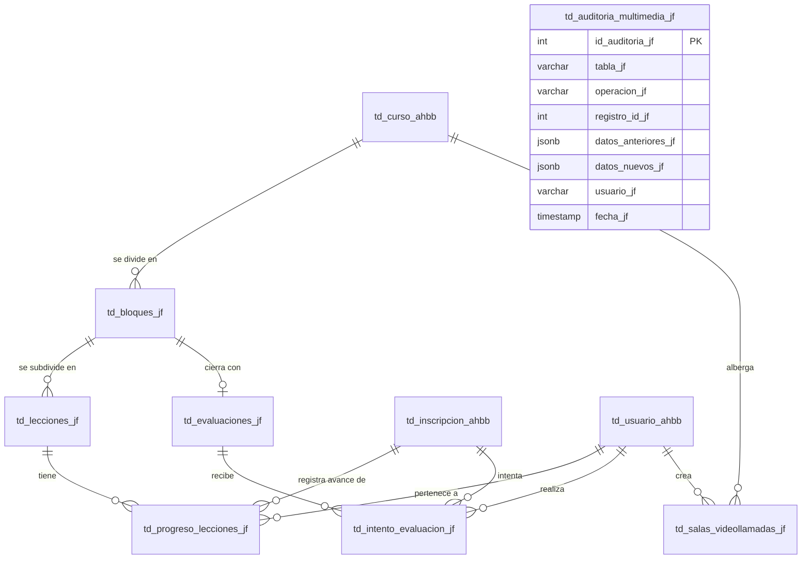

# 📹 DOCUMENTACIÓN TÉCNICA — MÓDULO CURSOS MULTIMEDIA Y VIDEOLLAMADAS (`_jf`)

Este módulo transforma la Academia H&B en una plataforma interactiva al estilo de Udemy. Permite estructurar cursos existentes con bloques, lecciones (videos, lecturas y recursos) y evaluaciones secuenciales, además de añadir videollamadas integradas en vivo sin dependencias pesadas de infraestructura local.

---

## 1. Modelo de Datos (DER)

A continuación se muestra cómo se estructuran las nuevas tablas `_jf` y sus relaciones con el esquema `_ahbb` heredado:



---

## 2. Decisiones de Arquitectura

### A. WebRTC Híbrido (SDK de Jitsi Meet)
*   **Decisión**: Usar el SDK de IFrame de Jitsi Meet (`meet.jit.si`) empaquetado en el frontend, en lugar de desplegar servidores TURN/STUN (Kurento, Janus) propios.
*   **Justificación**: Las videollamadas académicas directas requieren escalabilidad inmediata sin elevar la latencia ni los costos de cómputo en servidores de base. El backend NestJS conserva el control lógico, administrando el ciclo de vida de la sala, las autorizaciones de acceso por JWT y guardando la auditoría de duración, mientras Jitsi maneja eficientemente el ruteo SFU de audio y video de forma gratuita.
*   **Encapsulamiento**: Las llamadas al proveedor se abstraen en `multimedia.service_jf.ts` bajo métodos genéricos, facilitando una migración futura a plataformas corporativas como Agora o Twilio sin alterar el frontend.

### B. Row Level Security (RLS) en PostgreSQL
*   **Decisión**: Habilitar RLS nativo en PostgreSQL sobre `td_lecciones_jf` y `td_progreso_lecciones_jf`.
*   **Justificación**: Para evitar filtraciones donde un alumno lea lecciones de cursos donde no está inscrito, o acceda al progreso de otros estudiantes.
*   **Implementación**: Como Prisma funciona sobre una única conexión compartida en pool, implementamos RLS dinámico. El backend NestJS ejecuta todas las consultas de estas tablas dentro de transacciones Prisma que inicializan la sesión con:
    ```sql
    SET LOCAL app.usuario_actual = '<id_usuario>';
    ```
    La base de datos utiliza `current_setting('app.usuario_actual')` para filtrar las filas y bloquear accesos no autorizados a nivel de motor.

### C. Triggers de Auditoría
*   **Decisión**: Un trigger PostgreSQL que escribe en la tabla `td_auditoria_multimedia_jf` los cambios en lecciones y exámenes.
*   **Implementación**: Se crearon dos triggers `trg_auditar_lecciones_jf` y `trg_auditar_evaluaciones_jf` que se ejecutan automáticamente después de realizar `INSERT`, `UPDATE` o `DELETE`. Estos leen el usuario de la sesión (`app.usuario_actual`) y serializan el estado anterior (`OLD`) y nuevo (`NEW`) a tipo `JSONB`.

### D. Carga y Servido de Videos por Streams
*   **Decisión**: Multipart upload + HTTP Range requests.
*   **Justificación**: Evitar cargar los videos en memoria RAM. La subida se procesa en discos locales mediante streams y el servido soporta el código HTTP `206 Partial Content`. Esto permite a los navegadores buscar partes específicas de la lección (scrubbing) y reanudar la reproducción sin descargar el archivo de video completo.

---

## 3. Seguridad de Infraestructura Recomendada (Helmet + Nginx)

Para un entorno de producción, se recomienda configurar:
1.  **Helmet en NestJS**: Para asegurar headers HTTP como CSP (Content Security Policy), evitando inyecciones de iframes maliciosos pero permitiendo explícitamente el origen de Jitsi Meet:
    ```typescript
    app.use(helmet({
      contentSecurityPolicy: {
        directives: {
          defaultSrc: ["'self'"],
          scriptSrc: ["'self'", "https://meet.jit.si", "https://*.jit.si"],
          iframeSrc: ["'self'", "https://meet.jit.si", "https://*.jit.si"],
        }
      }
    }));
    ```
2.  **Nginx como Proxy Inverso**:
    *   Habilitar compresión Gzip para JSON.
    *   Configurar almacenamiento temporal y buffer para subida de videos grandes (ej. `client_max_body_size 100M;`).
    *   Terminar SSL (HTTPS) en Nginx para liberar de carga criptográfica al servidor de NestJS.
    *   Servir directamente los recursos de video estáticos (`/uploads/lecciones_jf/`) desde el disco usando directivas de Nginx, mitigando la sobrecarga del hilo de Node.js en streaming concurrente.

---

## 4. Guía de Prueba Paso a Paso (Ruta de Demostración)

### 1. Inicialización y Semillero
1.  Crea o verifica el archivo `backend/.env` con la conexión PostgreSQL local.
2.  Levanta y puebla la base de datos libre y académica:
    ```bash
    npm run start:dev     # en backend
    node scripts/seed-multimedia_jf.cjs  # siembra curso estructurado de prueba
    ```
3.  Inicia la interfaz de Quasar:
    ```bash
    yarn dev              # en frontend (abre http://localhost:9000)
    ```

### 2. Verificar el flujo del Alumno (Consumo Secuencial)
1.  Inicia sesión como la alumna **María** (`maria@estudiante.edu` / `alum123`).
2.  Ve al menú **"Aula Virtual (RP)"** -> **"Mi Aula Virtual"**.
3.  Selecciona el curso **"Diplomado en Alta Relojería de Precisión"**.
4.  Observa el playlist lateral:
    *   **Lección 1** ("Herramientas y banco de trabajo") está **Completada** (icono check verde).
    *   **Lección 2** ("Desarmando el calibre base") está **Desbloqueada** pero sin completar (icono play azul).
    *   **Lección 3** ("Guía de lubricación técnica") está **Bloqueada** (icono candado gris).
    *   **Evaluación del Bloque I** está **Deshabilitada** (no permite darle clic).
5.  Reproduce el video de la **Lección 2**. Deja que llegue al final (`@ended`). Al finalizar, verás una notificación de éxito y **reactivamente la Lección 3 se desbloqueará**.
6.  Selecciona la **Lección 3** (Lectura). Lee el contenido y presiona **"Marcar como leída"**.
7.  Al completar la lección 3, observa que todas las lecciones del bloque están listas, por lo que **se habilita automáticamente el examen del Bloque I**.

### 3. Evaluar e Intentos Limitados
1.  Haz clic en el examen **"Evaluación del Bloque I"** en la barra lateral.
2.  Se te presentará el cuestionario de selección múltiple (3 preguntas).
3.  Intenta fallar a propósito seleccionando respuestas incorrectas y dale a **"Enviar Respuestas"**.
4.  Observa el resultado: te mostrará que has reprobado y el número de intentos restantes decrecerá a 2.
5.  Vuelve a intentar y responde correctamente:
    *   Pregunta 1 -> Opción B (Almacenar la energía...)
    *   Pregunta 2 -> Opción B (Aceite sintético...)
    *   Pregunta 3 -> Opción A (Destornillador plano...)
6.  Al aprobar (nota >= 12), verás la corona dorada de éxito.
7.  Observa que **el Bloque II y su Lección 4 se desbloquean inmediatamente** en la barra lateral.

### 4. Intentar Acceso Prohibido (Seguridad RLS)
1.  Inicia sesión con otro alumno no inscrito (ej. **Elena** `elena@estudiante.edu` / `alum123`).
2.  Elena no verá este curso en su Aula Virtual.
3.  Si Elena intenta forzar la entrada llamando a la API en `http://localhost:3000/api/multimedia/cursos/1/contenido` (usando su token de sesión), la respuesta será:
    *   **Status: 403 Forbidden** (Mensaje: "No estás inscrito en este curso"). RLS bloquea la consulta a nivel de filas.

### 5. Videollamadas en Vivo
1.  Inicia sesión como el profesor **Carlos** (`carlos@academiah-b.edu` / `prof123`).
2.  Navega a **"Cursos Multimedia"** -> entra al **"Constructor Multimedia"** del curso -> ve al Paso 4 **"Videollamadas"**.
3.  Observa la videollamada programada. Haz clic en **"Iniciar Clase"**. Esto activará la sala cambiándola a `EN_VIVO`.
4.  Se abrirá la videollamada embebiendo a Jitsi. Entrarás automáticamente como **Moderador**.
5.  Inicia sesión de nuevo como **María**. Ve al Player del curso.
6.  Verás una barra de alerta verde arriba que avisa: *"¡Clase en vivo activa ahora!"*. Haz clic en **"Unirse Ahora"**.
7.  Jitsi se cargará en pantalla completa para María como **Participante**.
8.  Cuando Carlos termine la videollamada presionando **"Finalizar"**, la sala pasará a estado `FINALIZADA` y se registrará la duración de la sesión.
