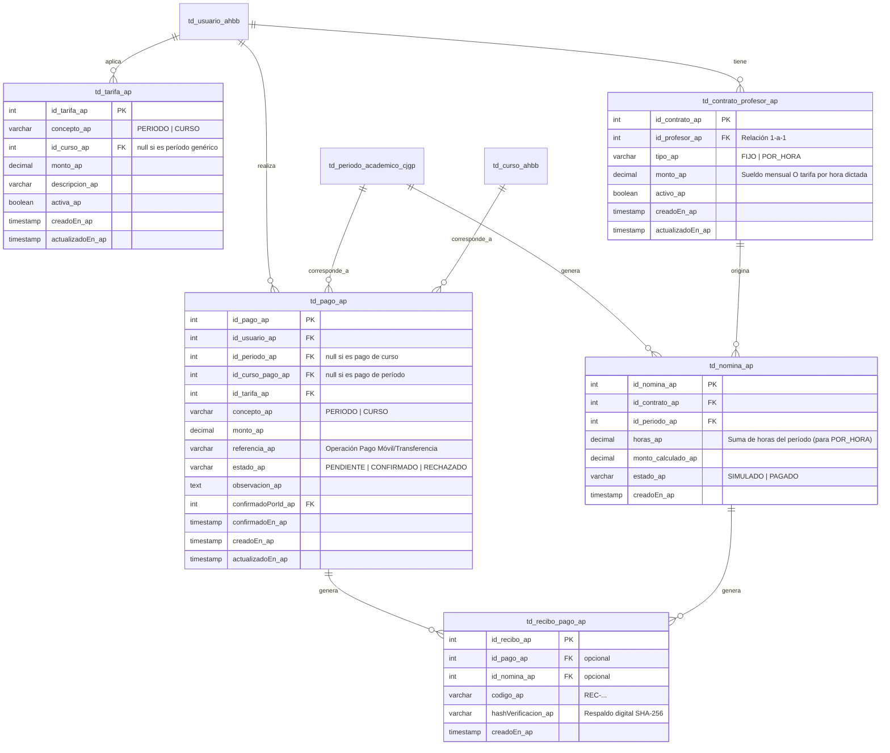

# Módulo de Sistema de Pagos (`_ap`) — AcademiaSenpai

Este módulo implementa el Sistema de Pagos universitario dentro de la plataforma **AcademiaSenpai**. 

---

## 1. Arquitectura y Modelo de Datos

Se han diseñado 5 tablas relacionales con el sufijo obligatorio `_ap` que interactúan de forma segura con los módulos existentes del sistema (Académico `_cjgp`, Control de Estudios `_jc`, y el Core `_ahbb`).

### DER (Diagrama Entidad-Relación)



---

## 2. Puntos de Integración Tocados

### A. Bloqueo de Inscripción en Carreras (`_cjgp`)
En el servicio `InscripcionMateriasService_cjgp.inscribir_cjgp`, se inyecta `PagosService_ap` para ejecutar el método guardián:
```typescript
await this.pagosService_ap.verificarSolvencia_ap(id_usuario_cjgp, id_periodo_cjgp);
```
Si el alumno no registra un pago en estado `CONFIRMADO` para el período y concepto `PERIODO`, se lanza una excepción controlada:
- **Respuesta API**: `BadRequestException` estructurada con código de error, mensaje y violaciones.
- **Frontend**: El componente `InscripcionMateriasView_cjgp.vue` despliega una alerta visible que le indica al estudiante su falta de solvencia e impide el uso del botón de inscripción.

### B. Bloqueo de Inscripción en Cursos Libres (`_ahbb`)
En `InscripcionesService_ahbb.crearInscripcion_ahbb` se realiza un control idéntico verificando si existe un pago `CONFIRMADO` específico para el curso extracurricular seleccionado.

---

## 3. Endpoints de la API

### Tarifas (`/api/pagos/tarifas`)
- `GET /` (ADMIN) — Lista todas las tarifas.
- `GET /periodo-activa` (ADMIN/ALUMNO/PROFESOR) — Obtiene la tarifa de período vigente.
- `POST /` (ADMIN) — Registra una tarifa.
- `PATCH /:id` (ADMIN) — Modifica o activa/desactiva una tarifa.
- `DELETE /:id` (ADMIN) — Elimina una tarifa (bloqueado si tiene pagos).

### Pagos de Alumnos (`/api/pagos`)
- `GET /mis-pagos` (ALUMNO) — Historial personal de aranceles y solvencia.
- `POST /` (ALUMNO) — Registra un pago móvil/transferencia (estado `PENDIENTE`).
- `GET /admin/todos` (ADMIN) — Bandeja de pagos por confirmar.
- `PATCH /admin/:id/confirmar` (ADMIN) — Confirma (`CONFIRMADO`) o rechaza (`RECHAZADO`) el pago de un alumno.
- `GET /admin/reporte-ingresos/:idPeriodo` (ADMIN) — Reporte dinámico utilizando una **Tabla Temporal de PostgreSQL** (`tmp_ingresos_ap ON COMMIT DROP`).
- `GET /recibo/:idPago` (ADMIN/ALUMNO) — Descarga del recibo oficial en PDF generado asíncronamente con `pdfmake`.

### Contratos de Profesores (`/api/pagos/contratos`)
- `GET /` (ADMIN) — Lista contratos de docentes.
- `GET /mi-contrato` (PROFESOR) — Consulta de contrato del docente autenticado.
- `POST /` (ADMIN) — Asigna o actualiza (upsert) un contrato docente.
- `PATCH /:id/desactivar` (ADMIN) — Desactiva un contrato.

### Nóminas (`/api/pagos/nomina`)
- `POST /generar/:idPeriodo` (ADMIN) — Simula/Genera la nómina del período activo para todos los profesores. Para tipo `POR_HORA`, calcula las horas dictadas cruzando con `td_sesion_curso_ahbb` y estimaciones de materias universitarias.
- `GET /periodo/:idPeriodo` (ADMIN) — Consulta las nóminas simuladas/pagadas.
- `PATCH /:id/pagar` (ADMIN) — Aprueba y efectúa el pago (`PAGADO`).
- `GET /mis-recibos` (PROFESOR) — Historial de recibos de nómina recibidos.
- `GET /recibo/:idNomina` (ADMIN/PROFESOR) — Descarga del recibo de nómina PDF con su **Código de Recibo** y **Hash SHA-256** de verificación.

---

## 4. Guía de Pruebas (Ruta paso a paso)

Para probar el flujo de punta a punta:

1. **Reiniciar datos académicos e iniciar seed de pagos**:
   ```bash
   npm run reset:academico
   npm run seed:pagos
   ```
2. **Entrar como Alumno Moroso**:
   - Inicia sesión con la cuenta de un alumno que no tiene pago confirmado (ej. el segundo alumno del seed).
   - Dirígete a **Inscripción de Materias**.
   - **Resultado Esperado**: Se mostrará un banner naranja advirtiendo que no estás solvente y el botón para confirmar la selección de materias estará bloqueado.
3. **Registrar Pago**:
   - Haz clic en **Ir a Mis Pagos** o ve a la sección **Mis Pagos** desde el menú.
   - Presiona **Pagar Período**, ingresa un número de referencia simulado (ej: `123456`) y envíalo.
   - **Resultado Esperado**: Tu pago aparecerá en estado `PENDIENTE` en tu historial de pagos.
4. **Confirmar Pago (Administrador)**:
   - Inicia sesión con cuenta de Administrador.
   - Ve a **Confirmar Pagos** en el menú.
   - Identifica el pago en estado `PENDIENTE` con la referencia que ingresó el alumno.
   - Presiona el botón verde de confirmación (`check_circle`), agrega una observación opcional y confirma.
   - **Resultado Esperado**: El pago pasará a estado `CONFIRMADO` y se habilitará la opción para descargar su recibo PDF oficial.
5. **Completar Inscripción**:
   - Vuelve a iniciar sesión como el Alumno.
   - Entra a **Inscripción de Materias**.
   - **Resultado Esperado**: El banner naranja habrá desaparecido. El alumno ahora puede seleccionar sus materias y presionar **Inscribir** para finalizar con éxito su período académico.
6. **Nómina de Profesores**:
   - Como Administrador, ve a **Contratos de Docentes** y configura las tarifas (FIJO o POR_HORA) para tus docentes.
   - Entra a **Nómina Docente**, selecciona el período activo y haz clic en **Generar / Recalcular**.
   - Revisa la simulación del listado de sueldos y haz clic en **Pagar** para aprobar la nómina.
   - Descarga el recibo de nómina del docente y verifica que posea el hash digital SHA-256 para evitar alteraciones.
