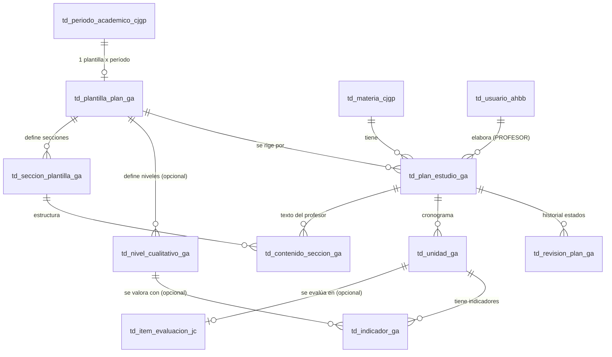

# Módulo de Plan de Estudio (_ga) - Planificación Académica

## 1. El Problema que Resuelve
En la configuración original, cada profesor planificaba el contenido de sus materias de forma independiente. Esto provocaba que la coordinación académica no pudiera:
1. Exigir un formato unificado (algunos profesores entregaban PDFs informales, otros hojas de cálculo).
2. Hacer seguimiento de quién había entregado su planificación.
3. Evaluar la calidad de los planes mediante un sistema de indicadores institucional.

## 2. La Solución (_ga)
Se implementó un **Desarrollo Basado en Metadatos**, inspirándose fuertemente en el módulo de Control de Estudios (`_jc`). 
La Coordinación Académica (Rol ADMIN) define, por período, una **Plantilla Institucional**. Esta plantilla dicta:
- Qué apartados textuales debe llenar el profesor (ej: Justificación, Competencias, Bibliografía).
- Qué sistema de valoración deben tener los indicadores de logro (Cuantitativo 0-20, Cuantitativo porcentual 0-100%, o Cualitativo: "Iniciado / En Proceso / Consolidado").

El profesor simplemente "llena" este formato dinámico en la plataforma. Todo el código del formulario en el frontend (y las validaciones en el backend) se adapta al formato configurado en la base de datos sin necesidad de tocar código.

---

## 3. Arquitectura de Datos (DER)

El módulo se compone de 8 tablas con el sufijo `_ga`, ancladas al módulo académico base (`_cjgp`) y al de control de estudios (`_jc`).

### Relaciones Externas Clave:
- **Materia (`td_materia_cjgp`)**: El plan de estudio se crea para una materia específica. Existe restricción `UNIQUE` para que solo haya 1 plan por materia y período.
- **Ítem Evaluación (`td_item_evaluacion_jc`)**: Permite vincular el Cronograma de la Unidad con los Cortes de Evaluación del Control de Estudios (Alineación Planificación-Evaluación).

---

## 4. Endpoints Principales

Todos bajo el prefijo `/api/v1/plan-estudio`.

### Plantillas (Admin)
- `GET /plantillas`: Lista las plantillas.
- `GET /plantillas/vigente/:idPeriodo`: Retorna la estructura para pintar el formulario.
- `POST /plantillas`: Crea el formato y sus secciones (Transaccional).
- `PATCH /plantillas/:id/publicar`: Congela la plantilla para uso.

### Planes (Profesor)
- `GET /mis-planes/:idPeriodo`: Lista los planes del profesor.
- `POST /`: Guarda el borrador del plan de estudio.
- `PUT /:id`: Actualiza borrador.
- `PATCH /:id/entregar`: Pasa el plan a revisión (valida requerimientos).

### Revisión (Admin)
- `GET /bandeja/:idPeriodo`: Planes entregados para revisar.
- `PATCH /:id/revisar`: Aprueba (genera Hash PDF) o Devuelve (exige observación).
- `GET /reporte-cumplimiento/:idPeriodo`: **Usa una TABLA TEMPORAL PostgreSQL** (`tmp_cumplimiento_ga`) para procesar métricas por carrera de forma segura.

### Compartidos
- `GET /:id/pdf`: Exportación con pdfMake.
- `GET /alumno/mis-planes/:idPeriodo`: Lectura para alumnos.

---

## 5. Ruta de Prueba Paso a Paso

Ejecuta el seed integrado para tener datos limpios:
`npm run reset:academico`

### A. Vista de Coordinación y Reporte (Tabla Temporal)
1. Inicia sesión como Admin (admin@academiah-b.edu / admin123).
2. Ve al menú **"Planificación (GA) > Bandeja de Revisión"**.
3. En la pestaña **Reporte de Cumplimiento**, observa la métrica: verás el % de planes entregados vs asignados en la carrera de Ingeniería. (Esto utiliza la tabla temporal `tmp_cumplimiento_ga` en BD).
4. En **Bandeja de Revisión**, verás que el Profesor ya entregó el Plan para MAT1. Haz clic en **Revisar**.
5. Pruébalo: Haz clic en **Devolver**, el sistema exigirá una observación (ej. "Mejorar los indicadores"). Devuélvelo.

### B. El Profesor elabora el Plan
6. Cierra sesión y entra como Profesor (carlos@academiah-b.edu / prof123).
7. Ve al menú **"Planificación (GA) > Elaborar Plan de Estudio"**.
8. Selecciona "2026-II" y la materia "Matemática I".
9. El sistema cargará tu plan. Verás un banner rojo con la observación de la coordinación.
10. Abre la **Unidad I**, agrega un nuevo Indicador y colócale un valor numérico (la plantilla es cuantitativa).
11. Haz clic en **Entregar a Coordinación**.

### C. La Magia de los Metadatos (Demostración)
12. Cierra sesión y entra de nuevo como Admin.
13. Ve a **"Planificación (GA) > Plantillas de Plan"**.
14. Crea una **Nueva Plantilla**. Llámala "Formato Cualitativo Especial", asigna el período "2026-I" (el período cerrado).
15. Selecciona el **Sistema de Valoración: Cualitativo**.
16. Agrega dos niveles: "Deficiente" y "Excelente".
17. Agrega una sección llamada "Proyecto Final" (Obligatoria). Guárdala y Publícala.
18. Ve con el Profesor al menú **Elaborar Plan de Estudio**, escoge "2026-I" y Matemática I.
19. **Observa:** El formulario cambió **sin modificar código**. Ahora te exige el "Proyecto Final", y al agregar indicadores, ya no pide números, sino que te da un desplegable para elegir "Deficiente" o "Excelente".

### D. Aprobación y PDF
20. Vuelve a iniciar sesión como Admin. Ve a la **Bandeja de Revisión**.
21. Aprueba el plan de MAT1 2026-II que el profesor había corregido.
22. Haz clic en el botón de la impresora para ver el **PDF exportado** con formato institucional, código autogenerado y el Hash de seguridad (usando `pdfmake`).

### E. Alumno
23. Entra como Alumno (maria@estudiante.edu / alum123).
24. Ve a **"Planificación (GA) > Planes de Estudio"**.
25. Verás tu materia MAT1 y su plan aprobado disponible en solo lectura.
