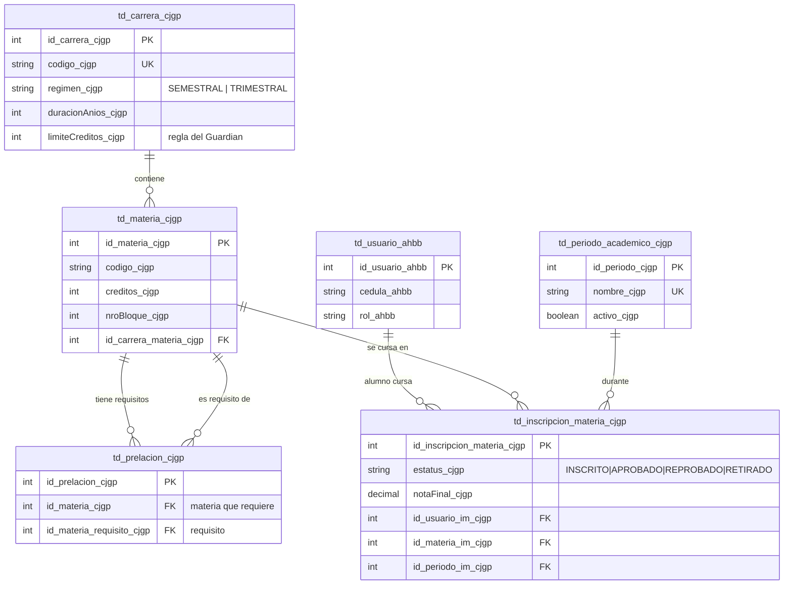

# 📘 README EXPLICACIÓN — Ampliación del Sistema AcademiaSenpai

<div align="center">

**Documento técnico maestro de la entrega**

*Qué se construyó · cómo funciona por dentro · dónde está cada pieza de código · cómo probarlo paso a paso*

`Vue 3 + Quasar 2` · `NestJS 11 + TypeScript` · `PostgreSQL + Prisma ORM` · `JWT` · `pdfmake` · `xlsx` · `Streams de Node.js`

</div>

---

## 🗺️ Mapa de módulos del sistema

El sistema heredado (`_ahbb`) se amplió con **seis módulos nuevos**. Cada uno
usa su propio sufijo obligatorio y **ninguno rompió el código anterior**:

| Módulo | Sufijo | Autor / Tarea | Qué aporta | Documento propio |
|---|:---:|---|---|---|
| **Carreras y Pensums · Motor de Reglas · Inscripción** | `_cjgp` | Coffi, Jorge, Guillermo y Padrino *(grupal)* | Pensums por bloques, prelaciones, límite de créditos, vitrina de inscripción | **este documento** |
| **Control de Estudios · Auditoría · RBAC** | `_jc` | Jean Coffi *(individual)* | Planes de evaluación, reparaciones por corte, actas, certificados de sobresaliente, auditoría y roles | [READMEEXPLICACION-CONTROLESTUDIOS.md](./READMEEXPLICACION-CONTROLESTUDIOS.md) |
| **Cursos Multimedia y Videollamadas** | `_jf` | Jorge Fanianos | Aula virtual tipo Udemy, video por streaming, evaluaciones, Jitsi en vivo, RLS y triggers | [READMEEXPLICACION-MULTIMEDIA.md](./READMEEXPLICACION-MULTIMEDIA.md) |
| **Sistema de Pagos y Nómina** | `_ap` | Padrino | Aranceles, solvencia como requisito de inscripción, contratos docentes, nómina, recibos PDF | [READMEEXPLICACION-PAGOS.md](./READMEEXPLICACION-PAGOS.md) |
| **Plan de Estudio (Planificación)** | `_ga` | Guillermo | Plantillas institucionales, planes por materia, bandeja de revisión, reporte de cumplimiento | [READMEEXPLICACION-PLANESTUDIO.md](./READMEEXPLICACION-PLANESTUDIO.md) |
| **Sistema base heredado** | `_ahbb` | Semestre anterior | Usuarios y roles, cursos libres, certificados con QR, tienda, dashboard | [README.md](./README.md) |

```
                            ┌───────────────────────────┐
                            │   SISTEMA BASE (_ahbb)    │
                            │ usuarios · roles · cursos │
                            │ certificados · tienda     │
                            └─────────────┬─────────────┘
                                          │
        ┌──────────────┬──────────────────┼──────────────────┬──────────────┐
        │              │                  │                  │              │
  ┌─────▼─────┐  ┌─────▼──────┐    ┌──────▼──────┐    ┌──────▼─────┐  ┌─────▼─────┐
  │  _cjgp    │  │    _jc     │    │    _ap      │    │    _ga     │  │    _jf    │
  │ Carreras  │─►│  Control   │    │   Pagos     │    │   Plan de  │  │Multimedia │
  │ Pensums   │◄─│ de Estudios│    │   Nómina    │    │  Estudio   │  │ Videollam.│
  └───────────┘  └────────────┘    └─────────────┘    └────────────┘  └───────────┘
        ▲               │                 │                  │
        │               │                 │                  │
        └───── el acta cerrada ───────────┘                  │
              desbloquea prelaciones                          │
        ▲                                                     │
        └──── el pago CONFIRMADO habilita la inscripción ─────┘
              (y el plan de estudio se alinea con los cortes de _jc)
```

> **Este documento** explica en profundidad la **tarea grupal `_cjgp`**
> (Carreras y Pensums, Motor de Reglas e Inscripción) y resume en §6 cómo se
> enganchan los demás módulos. Cada uno tiene su README propio (tabla de arriba);
> el módulo **individual `_jc`** se documenta en
> **[READMEEXPLICACION-CONTROLESTUDIOS.md](./READMEEXPLICACION-CONTROLESTUDIOS.md)**.

---

## Índice

| # | Sección | Contenido |
|---|---|---|
| 1 | [Análisis del sistema heredado](#1-análisis-del-sistema-heredado-e-identificación-del-problema) | Qué recibimos y qué problema se detectó |
| 2 | [Arquitectura de la ampliación](#2-arquitectura-de-la-ampliación) | Archivos creados, decisiones de diseño y tecnologías |
| 3 | [Épica 1 — Carreras y Pensums](#3-épica-1--creación-ágil-de-carreras-y-pensums) | Asistente, drag & drop, Excel, prelaciones |
| 4 | [Épica 2 — Motor de Reglas](#4-épica-2--el-motor-de-reglas-académicas-el-guardián) | El Guardián: prelaciones y créditos |
| 5 | [Épica 3 — Inscripción sin Fricción](#5-épica-3--inscripción-sin-fricción-para-el-estudiante) | Vitrina, calculadora en vivo, mensajes empáticos |
| 6 | [Los demás módulos de la ampliación](#6-los-demás-módulos-de-la-ampliación-_jc-_jf-_ap-_ga) | `_jc` control de estudios, `_jf` multimedia, `_ap` pagos, `_ga` plan de estudio |
| 7 | [DER del módulo académico](#7-der-del-módulo-académico) | Modelo de datos y constraints |
| 8 | [Seguridad aplicada](#8-seguridad-aplicada) | JWT, roles, DTOs, RLS, hash, CORS |
| 9 | [Cobertura de los requisitos académicos](#9-cobertura-de-los-requisitos-académicos) | Requisito del profesor → dónde está |
| 10 | [🧪 Ruta de prueba completa](#10--ruta-de-prueba-completa) | Pruebas con resultado esperado |
| 11 | [Referencia rápida de endpoints](#11-referencia-rápida-de-endpoints) | Tabla de la API |

---

## 1. Análisis del sistema heredado e identificación del problema

### 1.1 Qué recibimos

El sistema del semestre pasado (sufijo `_ahbb`) es una **academia de cursos
libres** con esta arquitectura:

- **Frontend:** Vue 3 + Quasar 2 (Composition API), peticiones asíncronas con
  **Axios**, estado global con **Pinia**, rutas protegidas por rol con Vue Router.
- **Backend:** **NestJS** (TypeScript) organizado en módulos
  (controlador → servicio → Prisma), con guards de **JWT** y de **roles**
  propios, filtro global de excepciones y CORS dinámico.
- **Base de datos:** **PostgreSQL** con **Prisma ORM** (migraciones versionadas,
  un stored procedure para generar sesiones de cursos y un trigger de
  consistencia de fechas).
- **Funcionalidades:** gestión de usuarios con aprobación de cuentas, cursos
  libres con horarios, inscripciones, certificados PDF con QR verificable,
  tienda e-commerce y dashboard.

### 1.2 Flujo del sistema heredado

```
Visitante → Registro → (Admin aprueba la cuenta) → Alumno
Alumno    → Oferta académica → se inscribe a un CURSO libre → Profesor lo evalúa
Profesor  → marca APROBADO → se emite certificado PDF con QR verificable
Admin     → gestiona usuarios, cursos, inscripciones, tienda y configuración
```

### 1.3 El problema identificado

El sistema **solo entiende de cursos sueltos e independientes**. No existe:

| Carencia | Consecuencia real |
|---|---|
| Concepto de **carrera** (pensum, bloques, créditos) | Configurar una carrera de años con decenas de materias sería un proceso manual, tedioso y propenso a errores del personal administrativo |
| **Prelaciones** entre materias | Un alumno podría cursar "Base de Datos II" sin haber aprobado "Base de Datos I" |
| **Límite de créditos** por período | Un alumno podría inscribir más carga de la permitida por el reglamento, generando problemas administrativos al cierre |
| **Plan de evaluación configurable** | Cualquier esquema de notas quedaría "cableado" (hard-coded) en el código: cambiar de 4 cortes a 3 módulos exigiría reprogramar el servidor |
| **Actas oficiales** | No hay respaldo formal e inalterable de las calificaciones que pueda cotejarse con el documento físico firmado |

### 1.4 La solución (valor de negocio)

Dos módulos nuevos que **extienden el sistema sin romper nada de lo existente**
(las tablas `_ahbb` no se modificaron; solo se agregaron relaciones nuevas):

1. **Módulo Académico `_cjgp` (grupal):** herramienta visual y automatizada para
   armar la oferta académica (Épica 1), un motor que aplica el reglamento de
   forma automática e invisible (Épica 2) y una experiencia de inscripción tan
   fluida como comprar en una tienda online (Épica 3).
2. **Módulo Control de Estudios `_jc` (individual):** gestión de notas y actas
   con **Desarrollo Basado en Metadatos** — toda la estructura de evaluación
   vive en la base de datos y el código solo la interpreta. Se documenta en
   [READMEEXPLICACION-CONTROLESTUDIOS.md](./READMEEXPLICACION-CONTROLESTUDIOS.md).

---

## 2. Arquitectura de la ampliación

### 2.1 Backend — archivos nuevos

```
backend/src/academico/                      ★ TAREA GRUPAL (_cjgp)
├── academico.module_cjgp.ts                Módulo NestJS que agrupa todo
├── carreras.controller_cjgp.ts             Endpoints de carreras/pensum/Excel
├── carreras.service_cjgp.ts                Lógica: validación de pensum, transacción, xlsx
├── periodos.controller_cjgp.ts             Endpoints de períodos académicos
├── periodos.service_cjgp.ts                Lógica: solo un período activo a la vez
├── motor-reglas.service_cjgp.ts            ★ ÉPICA 2: El Guardián
├── inscripcion-materias.controller_cjgp.ts Endpoints de vitrina e inscripción
├── inscripcion-materias.service_cjgp.ts    ★ ÉPICA 3: vitrina + inscripción auditada
└── dto/
    ├── crear-carrera.dto_cjgp.ts           DTO anidado con class-validator
    ├── crear-periodo.dto_cjgp.ts
    └── inscribir-materias.dto_cjgp.ts

backend/prisma/schema.prisma                +5 modelos nuevos (ver DER)
backend/prisma/migrations/2026...           Migración versionada de la ampliación
backend/scripts/seed-academico_cjgp.cjs     Datos de demostración (npm run seed:academico)
backend/src/main.ts                         + ValidationPipe global (class-validator)
backend/src/app.module.ts                   + registro de los módulos nuevos
```

Y, en la misma ampliación, los **tres módulos hermanos** (detallados en su
propio README, ver §7):

```
backend/src/multimedia/         ★ CURSOS MULTIMEDIA Y VIDEOLLAMADAS (_jf)
├── multimedia.module_jf.ts     Módulo NestJS
├── multimedia.controller_jf.ts Bloques, lecciones, progreso, evaluaciones, salas
├── multimedia.service_jf.ts    Streaming por rangos HTTP, RLS dinámico, Jitsi
└── dto/                        DTOs del constructor de cursos

backend/src/pagos/              ★ PAGOS Y NÓMINA (_ap)
├── pagos.module_ap.ts          Módulo NestJS
├── tarifas.controller/service  Aranceles por período y por curso
├── pagos.controller/service    Pago móvil, confirmación, solvencia, reporte
├── contratos.controller/service Contratos docentes (FIJO / POR_HORA)
├── nomina.controller/service   Cálculo y pago de nómina del período
└── recibos.service_ap.ts       Recibos PDF con código y hash SHA-256

backend/src/plan-estudio/       ★ PLANIFICACIÓN ACADÉMICA (_ga)
├── plan-estudio.module_ga.ts   Módulo NestJS
├── plantillas.controller/service Plantillas institucionales (metadatos del formato)
├── planes-estudio.controller/service Planes del profesor, revisión, PDF, reporte
└── dto/                        crear-plantilla · crear-plan-estudio · revisar-plan

backend/scripts/seed-multimedia_jf.cjs · seed-pagos_ap.cjs · setup-db-objects_jf.cjs
```

### 2.2 Frontend — archivos nuevos

```
frontend/src/servicios/
└── academicoServicio_cjgp.js               Capa Axios del módulo académico

frontend/src/pages/
├── admin/CarrerasView_cjgp.vue             Listado + malla curricular por bloques
├── admin/AsistenteCarreraView_cjgp.vue     ★ Asistente 4 pasos (drag&drop, Excel, prelaciones)
├── admin/PeriodosView_cjgp.vue             CRUD de períodos + activación
├── admin/InscripcionAlumnosAdminView_cjgp.vue  ★ El admin inscribe en nombre del alumno
├── alumno/InscripcionMateriasView_cjgp.vue ★ Vitrina + calculadora + modal empático
├── alumno/MisMateriasCarreraView_cjgp.vue  ★ Materias de carrera inscritas + retiro
├── alumno/HistorialCarreraView_cjgp.vue    ★ Expediente de carrera por período
├── profesor/MisMateriasProfesorView_cjgp.vue   ★ Materias asignadas al docente
└── profesor/HistorialMateriasProfesorView_cjgp.vue ★ Historial por período

frontend/src/router/routes.js               Rutas nuevas con sus roles
frontend/src/constantes/menuSistema_ahbb.js Menú reorganizado: "Mi Carrera" separado de
                                            "Cursos Extracurriculares"
```

> Los archivos del módulo **Control de Estudios (`_jc`)** —incluidos los
> subsistemas de **auditoría** y **RBAC**— se detallan en su propio documento:
> [READMEEXPLICACION-CONTROLESTUDIOS.md](./READMEEXPLICACION-CONTROLESTUDIOS.md)

Vistas de los módulos hermanos (§7):

```
frontend/src/servicios/
├── multimediaServicio_jf.js · pagosServicio_ap.js · planEstudioServicio_ga.js

frontend/src/pages/
├── profesor/CursosMultimediaView_jf.vue · ConstructorCursoView_jf.vue      (_jf)
├── alumno/AulaVirtualView_jf.vue · PlayerCursoView_jf.vue                  (_jf)
├── admin/TarifasView_ap.vue · ConfirmarPagosView_ap.vue                    (_ap)
├── admin/ContratosView_ap.vue · NominaView_ap.vue                          (_ap)
├── alumno/MisPagosView_ap.vue · profesor/MisRecibosView_ap.vue             (_ap)
├── admin/PlantillasPlanView_ga.vue · BandejaRevisionView_ga.vue            (_ga)
└── profesor/ElaborarPlanView_ga.vue · alumno/MisPlanesEstudioView_ga.vue   (_ga)
```

### 2.3 Decisiones de diseño importantes

1. **No se modificó ninguna tabla existente**: `td_usuario_ahbb` solo recibió
   *relaciones* nuevas (Prisma), sin columnas nuevas. Riesgo cero de regresión.
2. **El alumno elige carrera en la vitrina** (en lugar de "pertenecer" a una):
   evita alterar el flujo de registro heredado y permite demostrar varias
   carreras con los mismos alumnos.
3. **Validación duplicada a propósito**: la vitrina *muestra* lo que el motor
   decide, y la inscripción *re-audita* en el servidor con el mismo servicio.
   El frontend nunca es la única barrera.
4. **Integración entre las dos tareas**: el cierre de actas de `_jc` escribe
   `APROBADO/REPROBADO` en `td_inscripcion_materia_cjgp`, que es exactamente lo
   que consume el Motor de Reglas de `_cjgp` para desbloquear prelaciones.

### 2.4 Separación en el layout: CARRERAS vs CURSOS EXTRACURRICULARES

El sistema heredado maneja **cursos libres certificados** y la ampliación
agrega **carreras universitarias**: son dos mundos distintos, y el menú lateral
los separa explícitamente para que **cualquier usuario entienda la diferencia
de un vistazo**:

```
MENÚ DEL ALUMNO
├── Principal ................. Mi Panel · Mis Horarios
├── MI CARRERA ................ ★ Inscripción de Materias   (vitrina del pensum)
│                               ★ Mis Materias              (inscritas este período + retiro)
│                               ★ Mis Notas                 (calificaciones por corte)
│                               ★ Historial de Carrera      (expediente por período)
├── CURSOS EXTRACURRICULARES .. Oferta de Cursos · Mis Inscripciones de Cursos ·
│                               Historial de Cursos          (sistema _ahbb original)
├── Certificación ............. Mis Certificados
└── E-Commerce ................ Tienda Oficial
```

- En **"Mi Carrera"** el alumno inscribe las **materias del pensum** (con
  prelaciones y créditos), consulta sus **notas por corte** y su **expediente**.
- En **"Cursos Extracurriculares"** vive intacto el flujo original de cursos
  libres con certificado.
- La misma separación se aplica al menú del **profesor**, del **administrador**
  y del personal de **Control de Estudios**, cada uno con su propia sección
  "Control de Estudios (JC)".

### 2.5 Tecnologías utilizadas por el módulo académico

**Tarea grupal `_cjgp` (Carreras, Motor de Reglas, Inscripción):**


| Funcionalidad | Tecnología concreta |
|---|---|
| Asistente paso a paso | Quasar `q-stepper` con navegación validada por paso (Vue 3 Composition API) |
| Bloques dibujados en vivo | `computed()` de Vue: `duración × (régimen semestral ? 2 : 3)` reactivo |
| Arrastrar materias a bloques | **HTML5 Drag & Drop API** nativa (`draggable`, `dragstart`, `dragover`, `drop`) |
| Carga masiva del pensum | Librería **xlsx** (SheetJS) en NestJS: `XLSX.read` del buffer subido con **Multer** (`FileInterceptor`), plantillas generadas con `json_to_sheet` |
| Prelaciones visuales | Selección por dos clics con estado reactivo (`ref`) + chips de Quasar; validación de bloque anterior en cliente y servidor |
| Guardado todo-o-nada | **Transacciones interactivas de Prisma** (`$transaction`) |
| Motor de reglas | Servicio NestJS puro con consultas Prisma en paralelo (`Promise.all`) sobre el historial |
| Vitrina + calculadora de créditos | Axios (AJAX) + `computed` para la suma en vivo + `q-linear-progress` |
| Mensajes empáticos | `q-dialog` reutilizable alimentado por las violaciones que devuelve el Guardián |
| Validación de entrada | **class-validator / class-transformer** (DTOs anidados con `@ValidateNested`) + `ValidationPipe` global |

**Módulos hermanos (resumen — detalle en §6):**

| Módulo | Tecnologías destacadas |
|---|---|
| `_jf` Multimedia | **HTTP Range `206`** para video, **SDK IFrame de Jitsi Meet**, **Row Level Security** de PostgreSQL, **triggers** con `JSONB`, Multer para subida |
| `_ap` Pagos | Guard de solvencia inyectado en la inscripción, **tabla temporal** `tmp_ingresos_ap`, recibos **pdfmake + SHA-256**, cálculo de nómina FIJO/POR_HORA |
| `_ga` Plan de Estudio | Formularios generados desde **metadatos** (plantilla institucional), valoración cuantitativa/porcentual/cualitativa configurable, **tabla temporal** `tmp_cumplimiento_ga`, PDF con hash |
| `_jc` Control de Estudios | Metadatos del plan de evaluación, **Streams** para el ETL, **pdfmake + SHA-256** en actas y certificados, **tabla temporal** `tmp_rendimiento_jc`, `information_schema`, interceptor global de auditoría |

### 2.6 Qué hace cada rol en cada sección

**Módulo de Carreras (`_cjgp`, grupal):**

| Rol | Qué puede hacer |
|---|---|
| **Administrador** | Crear carreras con el asistente (o Excel), descargar plantillas semestral/trimestral, ver/eliminar carreras y su malla, **asignar el profesor que dicta cada materia**, gestionar períodos académicos y activar el vigente |
| **Profesor** | Consultar carreras y períodos, y ver las materias que tiene asignadas (el nombre del profesor acompaña a la materia en todas las vistas) |
| **Alumno** | Ver la vitrina de su carrera (cada materia con su profesor), inscribir materias (auditado por el Guardián), consultar **Mis Materias** (y retirar las que siguen en curso) y su **Historial de Carrera** |

> Los roles del **módulo de Control de Estudios (`_jc`)** —incluido el rol nuevo
> `CONTROL_ESTUDIOS`— se detallan en
> [READMEEXPLICACION-CONTROLESTUDIOS.md §2](./READMEEXPLICACION-CONTROLESTUDIOS.md).

---

## 3. Épica 1 — Creación Ágil de Carreras y Pensums

**Problema:** configurar una carrera de años con decenas de materias y reglas es
tedioso y propenso a error.
**Solución:** una herramienta visual y automatizada en 4 pasos.

### 3.1 El asistente paso a paso (`AsistenteCarreraView_cjgp.vue`)

| Paso | Qué hace el administrador | Qué hace el sistema |
|---|---|---|
| **1. Definir la carrera** | Escribe código, nombre, elige régimen (semestral/trimestral), duración en años y límite de créditos | **Calcula y "dibuja" los bloques en vivo**: semestral = 2 bloques/año, trimestral = 3/año. Un banner azul muestra "El sistema dibujará N bloques" y se actualiza al cambiar cualquier dato |
| **2. Armar el pensum** | Agrega materias al *banco* (código, nombre, créditos) y las **arrastra con el mouse** a su bloque (HTML5 drag & drop). O usa el **botón mágico** de Excel | Valida códigos duplicados; cada bloque es una zona de soltado que se ilumina al pasar por encima; una materia puede devolverse al banco o moverse de bloque |
| **3. Conectar prelaciones** | **1er clic** = materia que tiene el requisito; **2do clic** = la materia que debe aprobarse antes | Valida que el requisito esté en un **bloque anterior** (imposible crear ciclos hacia adelante); la conexión aparece como chip morado con candado, removible con la X |
| **4. Confirmar** | Revisa el resumen (bloques, materias, prelaciones, límite) y pulsa "Registrar carrera completa" | `POST /api/academico/carreras` crea **carrera + materias + prelaciones en UNA transacción Prisma**: si algo falla, no queda nada a medias |

### 3.2 Carga Masiva Excel — "el botón mágico"

Para carreras largas el administrador **no registra 60 materias una por una**:

- **Plantilla descargable por régimen**: `GET /api/academico/carreras/plantilla-pensum?regimen=SEMESTRAL|TRIMESTRAL`
  genera un `.xlsx` de ejemplo con la librería `xlsx`. El administrador elige
  en un menú desplegable (en el listado de carreras **y** dentro del paso
  "Armar el pensum" del asistente) entre la **plantilla semestral** (ejemplo de
  3 años / 6 semestres) o la **trimestral** (3 años / 9 trimestres), de modo
  que el ejemplo siempre calza con los bloques del régimen elegido.
- **Formato del archivo** (hoja 1, una fila por materia):

  | Codigo | Nombre | Creditos | Bloque | Prelaciones |
  |---|---|---|---|---|
  | MAT1 | Matemática I | 4 | 1 | |
  | BD2 | Base de Datos II | 4 | 4 | BD1 |
  | PRY1 | Proyecto de Grado | 6 | 6 | BD2;MAT2 |

  (varias prelaciones se separan con `;`)
- **Análisis sin persistir**: `POST /api/academico/carreras/pensum-excel/analizar`
  (multipart) lee el buffer con `XLSX.read`, valida fila por fila (código/nombre
  presentes, créditos y bloque enteros positivos) y devuelve el pensum
  interpretado + lista de errores con **número de fila exacto**. El asistente lo
  precarga en pantalla para que el administrador lo revise **antes** de guardar:
  el sistema construye la malla curricular automáticamente, pero el humano
  siempre confirma.

### 3.3 Validaciones del pensum (servidor)

`CarrerasService_cjgp.validarPensum_cjgp()` — compartida por el asistente y el
Excel para que ambas rutas apliquen **exactamente las mismas reglas**:

- Códigos de materia únicos dentro de la carrera.
- Bloque de cada materia dentro del rango de la carrera.
- Toda prelación debe **existir en el pensum**, no ser la propia materia y estar
  en un **bloque anterior**.
- El DTO (`CrearCarreraDto_cjgp`) valida además con **class-validator**:
  créditos 1–12, duración 1–7 años, régimen ∈ {SEMESTRAL, TRIMESTRAL},
  pensum no vacío (`@ValidateNested` sobre el arreglo de materias).

### 3.4 Asignación de profesores a las materias

En la malla curricular de cada carrera (**Carreras y Pensums → 👁 ver malla**),
el administrador asigna **quién dicta cada materia** con un selector por
materia (`PATCH /api/academico/carreras/materias/:id/profesor`; el servidor
valida que el usuario tenga rol PROFESOR). El profesor asignado se refleja en
**todas** las vistas: la vitrina del alumno, Mis Materias, Mis Notas, el
Historial de Carrera, el selector y la cabecera de la Carga de Notas del
docente. El dashboard del alumno (**Mi Panel**) también consume este módulo:
muestra sus **carreras**, materias **en curso** y **aprobadas**.

### 3.5 Criterio de aceptación

> *"Un coordinador debe poder registrar una carrera de 3 años en menos de 40 minutos."*

Con la plantilla Excel: **~2 minutos** (descargar plantilla → llenar → importar →
revisar → guardar). A mano con drag & drop: 10–15 minutos. En la ruta de prueba
de la sección 10 se cronometra el flujo completo.

---

## 4. Épica 2 — El Motor de Reglas Académicas (El Guardián)

**Problema:** alumnos que se inscriben sin estar preparados o que exceden la
carga permitida.
**Solución:** `MotorReglasService_cjgp` — el reglamento se aplica de forma
automática e invisible.

### 4.1 Bloqueo inteligente de prelaciones

`evaluarPensum_cjgp(alumno, carrera, período)` hace 3 consultas en paralelo
(`Promise.all`) y etiqueta **cada materia del pensum**:

| Condición | Regla exacta |
|---|---|
| `APROBADA` | Existe inscripción del alumno con `estatus = 'APROBADO'` en cualquier período (historial completo) |
| `INSCRITA` | Tiene inscripción `INSCRITO` en el período activo |
| `BLOQUEADA` | Al menos una de sus prelaciones **no** está aprobada — se devuelve la **lista exacta de requisitos faltantes** (código y nombre) para el mensaje del frontend |
| `ELEGIBLE` | Ninguna de las anteriores: la materia sí puede seleccionarse |

Como el sistema conoce el historial exacto, una materia bloqueada **ni siquiera
es seleccionable** en la vitrina (aparece gris con candado).

### 4.2 Control de créditos

`calcularCreditosInscritos_cjgp()` suma los créditos con estatus `INSCRITO` del
período. En la auditoría: `créditos ya inscritos + créditos nuevos ≤
limiteCreditos_cjgp` de la carrera (configurable por carrera, default 21).

### 4.3 Auditoría final (doble validación)

`auditarInscripcion_cjgp()` se ejecuta **en el servidor** justo antes de
inscribir. Revisa cada materia solicitada (¿existe?, ¿ya aprobada?, ¿ya
inscrita?, ¿bloqueada?) y el total de créditos. Si algo falla, responde
**HTTP 400 con la lista de violaciones en lenguaje claro**, por ejemplo:

```json
{
  "mensaje": "La inscripción no cumple el reglamento académico.",
  "violaciones": ["\"Base de Datos I\" requiere aprobar antes: Programación II."]
}
```

y **no se inscribe nada** (todo o nada). Aunque un alumno manipule el HTML o
llame a la API directamente con Postman, el Guardián lo detiene.

---

## 5. Épica 3 — Inscripción sin Fricción para el Estudiante

**Problema:** procesos de inscripción confusos que generan ansiedad.
**Solución:** `InscripcionMateriasView_cjgp.vue` — inscribirse se siente como
comprar en una tienda online moderna.

### 5.1 Vitrina de materias clara

- `GET /api/academico/inscripcion-materias/vitrina/:idCarrera` devuelve el
  pensum **agrupado por bloques**, cada materia con su condición y, si está
  bloqueada, con sus requisitos faltantes.
- En pantalla: materias **elegibles** en blanco con checkbox; **bloqueadas
  sombreadas en gris con candado 🔒** y el motivo visible ("Requiere: BD1") —
  evita falsas expectativas; **aprobadas** en verde con ✔; **ya inscritas** en
  ámbar. Hay leyenda de colores.

### 5.2 Calculadora reactiva en vivo

- `computed` de Vue suma los créditos al marcar/desmarcar: **sin recargar la
  página y sin llamar al servidor**.
- Barra `q-linear-progress` fija en la parte superior (sticky): muestra
  `X / 21 créditos`, incluye lo ya inscrito, y **cambia de color** (azul →
  ámbar > 75 % → naranja al llegar al límite).

### 5.3 Comunicación empática

Nunca un error rojo con códigos. Toda situación no permitida abre un **modal
limpio** (`q-dialog` con avatar 💡) que explica exactamente qué ocurre:

- Clic en materia bloqueada → *"Para cursar 'Base de Datos I' primero debes
  aprobar: Programación II. ¡Vas por buen camino!"*
- Intento de exceder créditos → *"Has alcanzado el límite máximo de 21 créditos
  para este período. Por favor, desmarca una materia para continuar."*
  (el aviso salta **antes** de marcar, no después de fallar)
- Si el servidor rechaza algo en la re-auditoría → el mismo modal muestra las
  violaciones que devolvió el Guardián, en el mismo lenguaje claro.

### 5.4 Las páginas "Mi Carrera" del alumno (contexto completo)

Además de la vitrina, el alumno tiene su propia sección **"Mi Carrera"** en el
menú (separada de los cursos extracurriculares):

| Página | Qué muestra |
|---|---|
| **Mis Materias** (`MisMateriasCarreraView_cjgp.vue`) | Las materias de carrera inscritas en el **período activo**, cada una con su carrera, bloque, créditos, **profesor que la dicta** y estatus; permite **retirar** las que siguen en curso (y reinscribirlas luego). Cabecera con la identidad del alumno (nombre, cédula) y sus créditos en curso |
| **Historial de Carrera** (`HistorialCarreraView_cjgp.vue`) | El expediente de lo **YA CURSADO** (aprobadas, reprobadas y retiradas — las materias en curso viven en Mis Materias/Mis Notas), **agrupado por período**: materia, carrera, **profesor**, bloque, créditos, **nota final** y condición, más un resumen global (aprobadas, reprobadas, retiradas, créditos aprobados) |
| **Mis Notas** (`MisNotasView_jc.vue`, módulo JC) | Solo materias **en curso**, con su profesor y actualización en tiempo real — ver [README de Control de Estudios](./READMEEXPLICACION-CONTROLESTUDIOS.md) |

En todas las vistas nuevas se muestra **el contexto completo**: quién es el
alumno (nombre y cédula desde la sesión), a qué carrera y bloque pertenece cada
materia, y qué período se está consultando.

### 5.5 Criterio de aceptación

> *"El estudiante completa su inscripción sin soporte técnico, con total
> claridad de por qué puede o no puede ver ciertas materias."*

Cada materia bloqueada muestra su motivo en la propia tarjeta y al hacer clic
se explica en palabras; la barra de créditos elimina la adivinanza. Verificable
en la ruta de prueba (sección 10, pruebas 8–10).

---

## 6. Los demás módulos de la ampliación (`_jc`, `_jf`, `_ap`, `_ga`)

Los demás módulos se construyeron **sobre las mismas bases** (NestJS + Prisma +
Quasar, sufijo obligatorio, JWT y guards de rol) y se enganchan con `_cjgp` en
puntos concretos. Aquí va el resumen; el detalle completo (DER, endpoints y ruta
de prueba de cada uno) vive en su README.

### 6.1 `_jc` — Control de Estudios *(tarea individual)*

📄 **[READMEEXPLICACION-CONTROLESTUDIOS.md](./READMEEXPLICACION-CONTROLESTUDIOS.md)**

Es el módulo que **califica** las materias del pensum: planes de evaluación
parametrizados (metadatos), reparaciones por corte, acta oficial en PDF con hash,
certificados de sobresaliente y carga masiva por CSV. Aportó además dos
subsistemas transversales a todo el sistema: la **bitácora de auditoría** y la
**consola de Roles y Accesos (RBAC)**, junto con el rol `CONTROL_ESTUDIOS`.

**Integración con este módulo:** al cerrar el acta escribe `APROBADO/REPROBADO` y
la nota final en `td_inscripcion_materia_cjgp`; eso es exactamente lo que lee el
Motor de Reglas (§4) para desbloquear las prelaciones en la vitrina.

### 6.2 `_jf` — Cursos Multimedia y Videollamadas

📄 **[READMEEXPLICACION-MULTIMEDIA.md](./READMEEXPLICACION-MULTIMEDIA.md)**

Convierte los **cursos libres** heredados (`_ahbb`) en un aula virtual tipo
Udemy: bloques → lecciones (video, lectura, recurso) → evaluación de bloque con
intentos limitados, y videollamadas en vivo.

| Pieza | Tecnología concreta |
|---|---|
| Video sin cargar RAM | **Streams + HTTP Range (`206 Partial Content`)** para scrubbing y reanudación |
| Videollamadas | **SDK IFrame de Jitsi Meet**; NestJS controla ciclo de vida de la sala, permisos y auditoría |
| Aislamiento de datos | **Row Level Security nativo de PostgreSQL** con `SET LOCAL app.usuario_actual` dentro de transacciones Prisma |
| Auditoría | **Triggers de PostgreSQL** que vuelcan `OLD`/`NEW` a `JSONB` en `td_auditoria_multimedia_jf` |
| Avance secuencial | Progreso por lección → desbloqueo reactivo de la siguiente y del examen |

**Integración:** se apoya en `td_curso_ahbb` y `td_inscripcion_ahbb`; no toca
las tablas de carreras.

### 6.3 `_ap` — Sistema de Pagos y Nómina

📄 **[READMEEXPLICACION-PAGOS.md](./READMEEXPLICACION-PAGOS.md)**

5 tablas (`td_tarifa_ap`, `td_pago_ap`, `td_contrato_profesor_ap`,
`td_nomina_ap`, `td_recibo_pago_ap`) que cierran el circuito económico:
el alumno reporta su pago móvil → el admin lo confirma → queda solvente;
y del otro lado, contratos docentes (FIJO / POR_HORA) → nómina del período →
recibo PDF.

**Integración fuerte con este documento:** `InscripcionMateriasService_cjgp`
llama a `PagosService_ap.verificarSolvencia_ap()` **antes** de inscribir. Es
decir, la inscripción de materias que se explica en §5 hoy tiene **dos
guardianes en cadena**:

```
Alumno pulsa "Inscribir"
   │
   ├─► ¿Está solvente en el período?  ── NO ─►  400 + banner naranja  (_ap)
   │            SÍ
   └─► ¿Cumple prelaciones y créditos? ── NO ─►  400 + modal empático (_cjgp)
                SÍ
        ✔ Inscripción registrada
```

También usa **tabla temporal** (`tmp_ingresos_ap ON COMMIT DROP`) para el
reporte de ingresos y **pdfmake + SHA-256** para los recibos, igual que las
actas de `_jc`.

### 6.4 `_ga` — Plan de Estudio (Planificación Académica)

📄 **[READMEEXPLICACION-PLANESTUDIO.md](./READMEEXPLICACION-PLANESTUDIO.md)**

8 tablas `_ga` que aplican **el mismo enfoque de Desarrollo Basado en
Metadatos** del módulo `_jc`, pero para la *planificación* en vez de la
*evaluación*: la coordinación define una **plantilla institucional** por
período (qué secciones textuales pedir, y si los indicadores se valoran de
forma cuantitativa 0–20, porcentual, o cualitativa con niveles configurables) y
el profesor llena ese formulario, que **se dibuja solo** a partir de la
configuración guardada.

**Integración con `_jc`:** cada unidad del cronograma puede vincularse a un
`td_item_evaluacion_jc` (Corte 1, Corte 2…), de modo que la planificación queda
**alineada con el plan de evaluación** que rige las notas. El reporte de
cumplimiento usa **tabla temporal** (`tmp_cumplimiento_ga`) y el PDF del plan
aprobado se firma con **hash**, igual que las actas.

### 6.5 Lo que comparten todos los módulos

| Patrón común | Dónde se repite |
|---|---|
| Configuración en BD, no en el código (metadatos) | Planes de evaluación `_jc` · Plantillas de plan `_ga` |
| Tabla temporal `ON COMMIT DROP` para reportes | `tmp_rendimiento_jc` · `tmp_ingresos_ap` · `tmp_cumplimiento_ga` |
| PDF con **pdfmake** + **hash SHA-256** de respaldo | Actas `_jc` · Recibos `_ap` · Planes `_ga` · Certificados `_ahbb` |
| Transacciones Prisma todo-o-nada | Carrera+pensum `_cjgp` · Notas `_jc` · Plantillas `_ga` |
| Guards `JwtAuthGuard_ahbb` + `RolesGuard_ahbb` | **Todos** los endpoints nuevos, sobre el catálogo `roles_jc.ts` |
| Bitácora de auditoría transversal | Interceptor global aportado por `_jc` — cubre a **todos** los módulos |
| DTOs con class-validator + `ValidationPipe` global | **Todos** los módulos |

---

## 7. DER del módulo académico

Cómo las tablas nuevas de configuración de notas se vinculan con las tablas de
materias, estudiantes y períodos:



> 🔗 **Punto de enganche con Control de Estudios:** `td_inscripcion_materia_cjgp`
> es la tabla bisagra. El módulo `_jc` cuelga de ella las calificaciones y las
> reparaciones, y al cerrar el acta escribe aquí `estatus_cjgp` y
> `notaFinal_cjgp` — que es justo lo que lee el Motor de Reglas para desbloquear
> prelaciones. El DER completo de `_jc` está en
> [READMEEXPLICACION-CONTROLESTUDIOS.md §11](./READMEEXPLICACION-CONTROLESTUDIOS.md).

**Integridad (Constraints de Postgres + Prisma):**

| Constraint | Regla de negocio que protege |
|---|---|
| `@@unique(alumno, materia, período)` en inscripciones | Un alumno no cursa la misma materia dos veces en un período |
| `@@unique(materia, requisito)` en prelaciones | No hay prelaciones duplicadas |
| `@@unique(codigo)` en carreras y períodos | Identificadores de negocio únicos |
| Cascadas `onDelete` | Borrar una carrera limpia materias→prelaciones→inscripciones→notas coherentemente |

---

## 8. Seguridad aplicada

| Capa | Implementación |
|---|---|
| **Autenticación** | JWT obligatorio en **todas** las rutas nuevas (`JwtAuthGuard_ahbb`) |
| **Autorización** | `RolesGuard_ahbb` + `@RolesDecorator_ahbb(...)` por endpoint, sobre el catálogo único de roles (`common/constantes/roles_jc.ts`): gestión de carreras y períodos solo ADMIN; vitrina e inscripción solo ALUMNO. Los permisos de Control de Estudios se detallan en su README |
| **Identidad del alumno** | El ID sale **siempre del token JWT** (`request.usuario.sub`), nunca del body: un alumno no puede inscribir ni consultar a otro |
| **Validación de datos (DTOs)** | `class-validator` + `class-transformer` con `ValidationPipe` global (`transform: true`) en `main.ts`: tipos coaccionados y validados antes de llegar a los servicios (previene inyección de datos maliciosos) |
| **CORS** | Configurado en `main.ts` para los orígenes del frontend |
| **Integridad** | Constraints de Postgres (tabla anterior) + transacciones Prisma (todo o nada) |
| **Auditoría** *(`_jc`)* | Bitácora transversal `td_auditoria_jc` alimentada por un **interceptor global**: toda petición que modifica datos queda registrada con quién, cuándo, sobre quién y desde qué IP |
| **Variables de entorno** | `DATABASE_URL` y credenciales solo en `.env` (ignorado por git) |
| **Row Level Security** *(`_jf`)* | RLS nativo de PostgreSQL sobre lecciones y progreso, activado por transacción con `SET LOCAL app.usuario_actual` |
| **Triggers de auditoría** *(`_jf`)* | `trg_auditar_lecciones_jf` / `trg_auditar_evaluaciones_jf` guardan `OLD`/`NEW` en `JSONB` |
| **Solvencia como guardián** *(`_ap`)* | La inscripción exige un pago `CONFIRMADO` del período antes de aplicar el motor de reglas |
| **Despliegue (recomendación)** | NestJS **detrás de Nginx como proxy inverso**: Nginx termina SSL (HTTPS), oculta el puerto 3000, limita el tamaño de subida de video y mitiga DoS básicos (rate limiting); **Helmet** para CSP |

---

## 9. Cobertura de los requisitos académicos

| Requisito del profesor | Dónde está en este proyecto |
|---|---|
| **Objeto / AJAX (Axios)** | Toda la comunicación es asíncrona con Axios: la vitrina y la calculadora de créditos actualizan los componentes **sin recargar la página** (`academicoServicio_cjgp.js`) |
| **Scripts de servidor (NestJS + TypeScript)** | Controladores/servicios/Prisma en `backend/src/academico` y `backend/src/control-estudios` |
| **Scripts de cliente (Vue 3 + Quasar, Composition API)** | Validación en vivo (Σ pesos = 100 %, límite de créditos, definitiva en vivo), Pinia para sesión, `computed`/`ref` en todas las vistas nuevas |
| **Maquetación responsiva** | Grid de Quasar (`row/col-12 col-md-*`), `q-stepper`, `q-table`, `q-linear-progress`, estilos SASS-CSS scoped |
| **Flujo AJAX del reporte** (parámetro → tabla temporal → JSON → tabla dinámica) | Consola → pestaña "Reporte de Rendimiento": el componente envía `idPeriodo`, NestJS crea `tmp_rendimiento_jc`, inserta los cálculos, devuelve JSON y la `q-table` se actualiza |
| **Seguridad: DTOs class-validator** | 5 DTOs nuevos + `ValidationPipe` global |
| **Seguridad: CORS** | `main.ts` |
| **Seguridad: JWT** | Guards en todos los endpoints nuevos |
| **Base de datos PostgreSQL + tablas temporales** | `CREATE TEMP TABLE ... ON COMMIT DROP` en `actas.service_jc.ts` |
| **Metadatos: information_schema + Vue** | Endpoint `metadatos` + pestaña "Diccionario de Datos" |
| **Integridad: Constraints + DTOs** | Secciones 7 y 8 |
| **Import/Export: Streams de Node.js + librerías de formato** | ETL CSV con `Readable`/`readline`; Excel con `xlsx`; PDF con `pdfmake` |
| **Sufijos exigidos** | Todo lo grupal termina en `_cjgp`; el módulo individual en `_jc`; los módulos hermanos en `_jf`, `_ap` y `_ga`; nada del código `_ahbb` se rompió |
| **Row Level Security y triggers** | Módulo `_jf` (ver [README de multimedia](./READMEEXPLICACION-MULTIMEDIA.md)) |
| **Streaming de archivos grandes** | Video por **HTTP Range `206`** en `_jf`; CSV por **Readable/readline** en `_jc` |

---

## 10. 🧪 RUTA DE PRUEBA COMPLETA

> Guion **exacto** para verificar que todo sirve, en orden, con lo que debe
> aparecer en pantalla en cada paso. Tiempo estimado total: **25–30 minutos**.
> Sirve tal cual como guion de demostración ante el profesor.

### Paso 0 — Preparación

```powershell
# Terminal 1 — Backend
cd backend
npm install
npm run start:dev
# Esperar el mensaje verde: "Nest application successfully started"

# Terminal 1 (o una nueva) — DEJAR LA BD EN EL ESTADO EXACTO DE ESTA GUÍA
cd backend
npm run reset:academico
# Borra SOLO los datos del módulo académico (_cjgp/_jc/_ga/_ap) y siembra el
# escenario limpio: períodos 2026-I/2026-II, carrera INF con 12 materias,
# PROFESORES ASIGNADOS, plan institucional publicado, historial de María
# e inscripciones con notas de Corte 1 y 2. No toca usuarios, cursos
# extracurriculares, tienda ni certificados.

npm run seed:pagos
# ⚠️ IMPRESCINDIBLE desde que existe el módulo de Pagos (_ap): la inscripción
# de materias ahora exige SOLVENCIA (un pago CONFIRMADO con concepto PERIODO).
# Este seed deja a MARÍA solvente y a los demás alumnos morosos, que es
# justo el escenario que usan las pruebas 12 (inscribe) y las de pagos.
# Si lo omites, la Prueba 12 fallará con "Debes cancelar el arancel del
# período para poder inscribir materias" — y eso también es una prueba
# válida del guardián de _ap.

# Terminal 2 — Frontend
cd frontend
npm install
npm run dev
# Se abre http://localhost:9000
```

> 🔄 **IMPORTANTE — repetir la demo desde cero:** cada vez que quieras volver
> a seguir esta ruta de prueba (porque ya creaste carreras, inscribiste
> materias, cargaste notas o cerraste actas probando), ejecuta de nuevo
> `npm run reset:academico`. La BD queda **idéntica** al punto de partida que
> asumen las 26 pruebas: 1 carrera (INF), 12 materias con profesor, 2
> períodos, 1 plan publicado, María con el bloque 1 aprobado y 3 alumnos
> inscritos en MAT1/PRG1 con los dos primeros cortes cargados, **0 actas**.
> (Si solo quieres agregar los datos demo sin borrar nada, usa
> `npm run seed:academico`.)

> ⚠️ Si el backend no arranca por la BD, revisa `backend/.env`
> (`DATABASE_URL` con tu contraseña de PostgreSQL).

**Credenciales:**

| Rol | Correo | Clave |
|---|---|---|
| Admin | `admin@academiah-b.edu` | `admin123` |
| Profesor | `carlos@academiah-b.edu` | `prof123` |
| Profesora | `ana@academiah-b.edu` | `prof123` |
| Alumna | `maria@estudiante.edu` | `alum123` |
| Alumno | `javier@estudiante.edu` | `alum123` |

---

### BLOQUE A — Épica 1: carreras, pensums y profesores (como ADMIN)

**Prueba 1 — El asistente dibuja los bloques.**
1. Inicia sesión como **admin** → menú lateral, sección **"Carreras (CJGP)"** →
   **Carreras y Pensums**.
2. ✅ *Esperado:* tabla con la carrera **INF — Ingeniería en Informática**
   (semestral, 3 años, 6 bloques, 12 materias) creada por el seed.
3. Clic en **"Nueva carrera (asistente)"**.
4. Paso 1: escribe código `MED`, nombre `Medicina Veterinaria`, elige
   **TRIMESTRAL**, duración **2** años, límite **15** créditos.
5. ✅ *Esperado:* el banner azul dice **"El sistema dibujará 6 bloques"**
   (2 años × 3 trimestres). Cambia a SEMESTRAL → dice **4 bloques**. Vuelve a
   TRIMESTRAL. Los bloques se recalculan **en vivo, sin recargar**.

**Prueba 2 — Drag & drop de materias.**
1. Clic en **Continuar**. En el banco agrega: `ANA1` / `Anatomía I` / 5
   créditos → **Agregar**; luego `ANA2` / `Anatomía II` / 5; luego `ETO1` /
   `Etología` / 3.
2. **Arrastra con el mouse** `ANA1` y `ETO1` al **Trimestre 1**, y `ANA2` al
   **Trimestre 2**.
3. ✅ *Esperado:* las tarjetas cambian de amarillo (banco) a verde (ubicadas);
   la zona del bloque se ilumina al pasar por encima; el botón ↩ devuelve una
   materia al banco.

**Prueba 3 — Prelaciones visuales con dos clics.**
1. **Continuar** → Paso 3. Haz **clic en `ANA2`** (se resalta morado) y luego
   **clic en `ANA1`**.
2. ✅ *Esperado:* notificación **"🔗 ANA2 ahora requiere ANA1"** y un chip
   morado con candado `ANA1` dentro de la tarjeta de ANA2.
3. **Prueba negativa:** clic en `ANA1` (bloque 1) y luego en `ANA2` (bloque 2).
   ✅ *Esperado:* aviso **"El requisito debe estar en un bloque anterior"** —
   el sistema impide prelaciones imposibles.
4. **Continuar** → Paso 4 → ✅ resumen (6 bloques, 3 materias, 1 prelación) →
   **"Registrar carrera completa"** → notificación verde y regreso al listado
   con **MED** ya visible.

**Prueba 4 — Plantilla Excel SEMESTRAL o TRIMESTRAL (menú desplegable).**
1. En **Carreras y Pensums**, el botón **"Plantilla Excel"** es un
   **menú desplegable**: ábrelo.
2. ✅ *Esperado:* dos opciones con su descripción — **"Plantilla Semestral —
   Ejemplo de 3 años · 6 semestres"** y **"Plantilla Trimestral — Ejemplo de
   3 años · 9 trimestres"**.
3. Descarga **ambas**. ✅ *Esperado:* archivos
   `Plantilla_Pensum_SEMESTRAL.xlsx` y `Plantilla_Pensum_TRIMESTRAL.xlsx`.
   Al abrirlos: la semestral usa bloques 1–6 y la trimestral llega al
   **bloque 9** (con más materias de ejemplo, ej. `SEG1` en el bloque 8).
4. El **mismo desplegable** está dentro del asistente: "Nueva carrera
   (asistente)" → Paso 2 → sección "⚡ Carga masiva desde Excel" → botón
   **"Plantilla"**.

**Prueba 5 — El botón mágico (carga masiva Excel).**
1. **"Nueva carrera (asistente)"** → Paso 1: código `TST`, nombre
   `Carrera de Prueba Excel`, **SEMESTRAL**, 3 años → Continuar.
2. En el Paso 2, sube la **plantilla semestral** descargada →
   **"Importar pensum"**.
3. ✅ *Esperado:* notificación **"✨ 9 materias importadas y ubicadas en sus
   bloques"** con sus prelaciones cargadas (se ven en el Paso 3). Guarda.
4. En el listado, clic en el ojito 👁 de `TST` → ✅ malla curricular por
   bloques con "🔒 Requiere: …" en las materias con prelación.

**Prueba 6 — Períodos académicos.**
1. Menú → **Períodos Académicos**.
2. ✅ *Esperado:* `2026-II` con chip verde **ACTIVO** y `2026-I` cerrado.
3. Crea `2027-I` con fechas cualquiera **sin** activarlo → aparece "Cerrado".
   (No lo actives: el resto de la demo usa 2026-II.)

**Prueba 7 — Asignar el profesor que dicta cada materia.**
1. **Carreras y Pensums** → ojito 👁 de **INF** para abrir la malla.
2. ✅ *Esperado:* cada materia muestra **"👨‍🏫 Prof. …"** (el seed asigna
   round-robin: MAT1→Carlos, PRG1→Ana, ING1→Luis, y así sucesivamente).
3. En **SOP1** (Sistemas Operativos), despliega el selector y cambia el
   profesor a **Ana Borges**. *(Usa una materia sin inscritos: MAT1 debe
   seguir siendo de Carlos para las pruebas 17–22.)*
4. ✅ *Esperado:* notificación **"Profesor Ana Borges asignado a SOP1"** y la
   malla se refresca mostrando el cambio.
5. *(Negativa, por API)*: intentar asignar un usuario que no es profesor
   devuelve *"El usuario indicado no existe o no tiene rol de PROFESOR."*
   (verificado con curl).
6. Este profesor aparecerá en **todas** las vistas del alumno y del docente
   (pruebas 10, 13 y 14) — y en la **Prueba 27** verás que el cambio también
   mueve la materia de una Carga de Notas a otra.

---

### BLOQUE B — Épicas 2 y 3: la experiencia del alumno (como MARÍA)

**Prueba 8 — Mi Panel muestra la carrera del alumno.**
1. Cierra sesión → entra como **maria@estudiante.edu / alum123** →
   **Mi Panel**.
2. ✅ *Esperado (estado inicial del reset):*
   - Tarjetas de estadísticas: **Mis Carreras (1)** · **Materias de Carrera
     Inscritas (3)** · Cursos Extracurriculares · Certificados.
   - Sección **"🎓 Mi Carrera"** con el chip **"Ingeniería en Informática"**,
     **0 materias en curso** y **3 materias aprobadas** (su bloque 1 de
     2026-I), y accesos directos a "Inscribir materias" y "Mis notas".
3. *(Después de inscribirse en la Prueba 12, vuelve aquí: verás 3 en curso
   y el total de inscritas en 6.)*

**Prueba 9 — El layout separa CARRERA de CURSOS EXTRACURRICULARES.**
1. Observa el menú lateral.
2. ✅ *Esperado:* dos secciones claramente separadas:
   - **"MI CARRERA"**: Inscripción de Materias · Mis Materias · Mis Notas ·
     Historial de Carrera.
   - **"CURSOS EXTRACURRICULARES"**: Oferta de Cursos · Mis Inscripciones de
     Cursos · Historial de Cursos (el sistema original intacto).

**Prueba 10 — Vitrina clara con candados, profesor y contexto completo.**
1. **Mi Carrera → Inscripción de Materias** → selecciona
   **Ingeniería en Informática**.
2. ✅ *Esperado:*
   - Tarjeta de contexto: **"Alumno: Maria Garcia (V-20000001) · Carrera:
     Ingeniería en Informática (SEMESTRAL) · Período: 2026-II · Límite: 21
     créditos"**.
   - **Cada materia muestra su profesor**: "👨‍🏫 Prof. Carlos Mendez", etc.
   - **Semestre 1** completo en **verde con ✔** (lo aprobó en 2026-I).
   - **Semestre 2** (`MAT2`, `PRG2`, `ING2`) en blanco = **elegible**.
   - **`BD1` (Semestre 3) en gris con 🔒** y el texto **"Requiere: PRG2"**.

**Prueba 11 — El Guardián explica con empatía (prueba negativa).**
1. Haz **clic sobre la tarjeta gris de `BD1`**.
2. ✅ *Esperado:* **modal empático** (sin códigos de error):
   *"Para cursar 'Base de Datos I' primero debes aprobar: Programación II.
   ¡Vas por buen camino!"*

**Prueba 12 — Calculadora reactiva e inscripción.**
1. Marca `MAT2` (4 cr) → la barra sube a 4/21 **al instante**; marca `PRG2`
   (5 cr) → 9/21; marca `ING2` (3 cr) → 12/21. La suma es **en tiempo real,
   sin recargar**.
2. Deja marcadas las tres y pulsa **"Inscribir 3 materia(s)"**.
3. ✅ *Esperado:* notificación verde **"Inscripción procesada: 3 materia(s)
   registradas para 2026-II"**; las tarjetas pasan a ámbar **"Ya inscrita"** y
   la barra queda fija en **12 / 21**.
4. 💳 *(Guardián de `_ap`)*: entra con **javier@estudiante.edu** (moroso) e
   intenta lo mismo → ✅ banner naranja de **falta de solvencia** y botón de
   inscripción bloqueado. Confírmale el pago como admin (**Confirmar Pagos**) y
   vuelve a intentar → ahora sí pasa al Motor de Reglas. Detalle completo en el
   [README de pagos](./READMEEXPLICACION-PAGOS.md).

**Prueba 13 — Mis Materias (inscripciones de carrera + retiro).**
1. **Mi Carrera → Mis Materias**.
2. ✅ *Esperado:* cabecera con **"Maria Garcia · Cédula V-20000001 · Período
   activo: 2026-II"** y el contador **12 créditos en curso**; una tarjeta por
   materia con **carrera, semestre, créditos, 👨‍🏫 profesor que la dicta,
   período y estatus EN CURSO**.
3. En `ING2` pulsa **"Retirar"** → confirma.
4. ✅ *Esperado:* la tarjeta desaparece y el contador baja a **9 créditos**.
5. *(Robustez)*: vuelve a **Inscripción de Materias** → `ING2` aparece
   **elegible otra vez** y puedes reinscribirla sin error (la inscripción
   retirada se reactiva). Reinscríbela para las pruebas siguientes.

**Prueba 14 — Historial de Carrera: SOLO lo ya cursado, con profesor.**
1. **Mi Carrera → Historial de Carrera**.
2. ✅ *Esperado:*
   - **NO aparecen** las materias en curso (MAT2/PRG2/ING2): el expediente
     solo lista lo **culminado** — lo actual vive en Mis Materias/Mis Notas.
   - Tarjeta **"Período 2026-I"** con MAT1 (16), PRG1 (17), ING1 (14) en
     verde **APROBADO**; cada fila muestra código, materia, carrera,
     **Profesor**, bloque, créditos y nota final.
   - Resumen: **3 aprobadas · 0 reprobadas · 0 retiradas · 12 créditos
     aprobados**.

---

### BLOQUE F — La asignación de profesores es FUNCIONAL (no solo visual)

**Prueba 27 — Reasignar profesor mueve la materia entre Cargas de Notas.**
1. Como **admin** → Carreras y Pensums → 👁 malla de INF → cambia el profesor
   de **MAT1** a **Ana Borges** (queda guardado **en la base de datos**).
2. Entra como **ana@academiah-b.edu / prof123** → **Carga de Notas y Actas**
   → período 2026-II.
3. ✅ *Esperado:* en el selector de Ana ahora aparece **MAT1** (además de la
   suya) **con sus 3 alumnos inscritos**, lista para cargar notas.
4. Entra como el profesor que la tenía antes → ✅ MAT1 **ya no aparece** en su
   selector, y si no le quedan materias ve el aviso *"No tienes materias
   asignadas…"*. Un PROFESOR solo ve **sus** materias; el ADMIN sigue viéndolas
   todas.

**Prueba 28 — Paneles de PROFESOR y ADMIN (como el del alumno).**
1. Como **profesor** → **Mi Panel** → ✅ tarjetas **Materias Asignadas** y
   **Alumnos en mis Materias** + sección **"🎓 Mis Materias de Carrera"** con
   el chip de su carrera, contadores y accesos a "Mis materias"/"Cargar notas".
2. Como **admin** → **Mi Panel** → ✅ tarjetas **Carreras** y **Materias en
   Pensums** + sección **"🎓 Módulo de Carreras"** con los chips de todas las
   carreras, inscripciones en curso, planes publicados, el período activo y
   accesos a "Nueva carrera"/"Inscribir alumnos".

**Prueba 29 — Mis Materias y Mi Historial de Materias (docente).**
1. Como **profesor** → menú **Carreras (CJGP) → Mis Materias**.
2. ✅ *Esperado:* una tarjeta por materia asignada (carrera, bloque, créditos,
   **N alumnos cursando**) con botón directo a "Cargar notas".
3. Menú → **Mi Historial de Materias** → ✅ tabla por período con cada materia
   dictada: en curso, aprobados, reprobados, retirados y **promedio** de
   notas finales.

**Prueba 30 — Asignar profesores DESDE el asistente de carrera.**
1. Como **admin** → Nueva carrera (asistente) → Paso 2.
2. ✅ El formulario de agregar materia incluye el selector **"Profesor"**, y
   cada tarjeta (banco o bloque) tiene su propio **"👨‍🏫 Asignar…"**.
3. Crea una carrera con materias con y sin profesor → Paso 4 muestra
   **"Materias con profesor asignado: X de Y"** → guarda.
4. ✅ En la malla, las materias quedaron con su profesor (persistido en BD).
   *(Negativa verificada por API: asignar a alguien sin rol PROFESOR devuelve
   "Uno de los profesores asignados no existe o no tiene rol de PROFESOR.")*

**Prueba 31 — El admin inscribe MATERIAS en nombre de un alumno.**
1. Como **admin** → menú **Carreras (CJGP) → Inscripción de Alumnos**.
2. Selecciona a **Maria Garcia** y la carrera **INF**.
3. ✅ *Esperado:* la MISMA vitrina que ve María (verde ✔ su bloque 1, candados
   con motivo, profesor por materia, barra de créditos).
4. Intenta marcar `BD1` → ✅ modal: el Guardián también frena al admin
   (verificado además por API: HTTP 400 con la violación).
5. Marca `MAT2` → **Inscribir** → ✅ *"Inscripción procesada: 1 materia(s)…"*;
   María la verá en **Mis Materias** y en **Mis Notas**.

**Prueba 32 — El admin inscribe un alumno en un CURSO extracurricular.**
1. Como **admin** → **Cursos Extracurriculares → Inscripciones de Cursos** →
   botón **"Inscribir alumno en curso"**.
2. Selecciona un alumno activo y un curso publicado → **Inscribir**.
3. ✅ *Esperado:* notificación verde; el servidor aplica las mismas
   validaciones que la auto-inscripción (probado: si el alumno ya aprobó el
   curso responde *"El alumno ya aprobó este curso."*).

### Checklist final de la demostración

| # | Qué queda demostrado | Prueba |
|---|---|---|
| 1 | Asistente paso a paso + bloques dibujados por el sistema | 1 |
| 2 | Drag & drop de materias a bloques | 2 |
| 3 | Prelaciones visuales con validación de bloque | 3 |
| 4 | Plantilla Excel por régimen (semestral / trimestral) | 4 |
| 5 | Carga masiva del pensum por Excel | 5 |
| 6 | **Asignación de profesor por materia (reflejada en todo el sistema)** | 7, 10, 13, 14 |
| 7 | **Mi Panel del alumno: carreras + materias inscritas** | 8 |
| 8 | Layout que separa Mi Carrera de Cursos Extracurriculares | 9 |
| 9 | Bloqueo inteligente por prelaciones (vitrina + servidor) | 10, 11 |
| 10 | Control de créditos con calculadora reactiva | 12 |
| 11 | Mensajes empáticos (nunca errores con códigos) | 11 |
| 12 | Mis Materias de carrera + retiro (con reinscripción) | 13 |
| 13 | **Historial de Carrera: solo lo cursado, con profesor y nota final** | 14 |
| 14 | **Reasignar profesor mueve la materia entre Cargas de Notas (BD, no visual)** | 27 |
| 15 | **Paneles de profesor y admin con su sección de carreras** | 28 |
| 16 | **Mis Materias + Mi Historial de Materias del docente** | 29 |
| 17 | **Profesores asignables desde el asistente de carrera** | 30 |
| 18 | **Admin inscribe materias por el alumno (Guardián incluido)** | 31 |
| 19 | **Admin inscribe alumnos en cursos extracurriculares** | 32 |

> Las pruebas del módulo de **Control de Estudios** (planes de evaluación,
> reparaciones, actas, certificados de sobresaliente, auditoría y RBAC) tienen su
> propio guion en
> [READMEEXPLICACION-CONTROLESTUDIOS.md §14](./READMEEXPLICACION-CONTROLESTUDIOS.md).

---

## 11. Referencia rápida de endpoints

Todos bajo `http://localhost:3000/api`, protegidos con `Authorization: Bearer <JWT>`.

### Módulo Académico (`_cjgp`)

| Método | Ruta | Rol | Descripción |
|---|---|---|---|
| GET | `/academico/carreras` | todos | Listado con totales de bloques/materias |
| GET | `/academico/carreras/:id` | todos | Detalle con malla por bloques y prelaciones |
| POST | `/academico/carreras` | ADMIN | Crear carrera completa (transaccional) |
| POST | `/academico/carreras/pensum-excel/analizar` | ADMIN | Interpretar Excel sin persistir |
| PATCH | `/academico/carreras/materias/:idMateria/profesor` | ADMIN | Asignar/retirar el profesor que dicta la materia |
| GET | `/academico/carreras/plantilla-pensum?regimen=SEMESTRAL\|TRIMESTRAL` | ADMIN | Descargar plantilla .xlsx adaptada al régimen |
| DELETE | `/academico/carreras/:id` | ADMIN | Eliminar (cascada) |
| GET/POST | `/academico/periodos` · `/activo` | ADMIN crea | Períodos; solo uno activo |
| PATCH | `/academico/periodos/:id/activar` | ADMIN | Activar (desactiva el resto, atómico) |
| GET | `/academico/inscripcion-materias/vitrina/:idCarrera` | ALUMNO | Vitrina etiquetada + créditos |
| POST | `/academico/inscripcion-materias/:idCarrera` | ALUMNO | Inscribir (re-auditado por el Guardián) |
| GET | `/academico/inscripcion-materias/historial` | ALUMNO | Historial propio |
| DELETE | `/academico/inscripcion-materias/:idInscripcion` | ALUMNO | Retirar materia en curso |

### Módulos hermanos

| Módulo | Prefijo de la API | Tabla completa de endpoints |
|---|---|---|
| Control de Estudios (`_jc`) | `/api/control-estudios/...` · `/api/auditoria/...` · `/api/rbac/...` | [README de control de estudios §13](./READMEEXPLICACION-CONTROLESTUDIOS.md) |
| Cursos Multimedia (`_jf`) | `/api/multimedia/...` | [README de multimedia](./READMEEXPLICACION-MULTIMEDIA.md) |
| Pagos y Nómina (`_ap`) | `/api/pagos/...` | [README de pagos §3](./READMEEXPLICACION-PAGOS.md) |
| Plan de Estudio (`_ga`) | `/api/v1/plan-estudio/...` | [README de plan de estudio §4](./READMEEXPLICACION-PLANESTUDIO.md) |

### Ejemplo de consumo con curl (verificado)

```bash
# 1. Login
TOKEN=$(curl -s -X POST http://localhost:3000/api/auth/iniciar-sesion \
  -H "Content-Type: application/json" \
  -d '{"correo_ahbb":"maria@estudiante.edu","contrasena_ahbb":"alum123"}' \
  | sed -n 's/.*"token":"\([^"]*\)".*/\1/p')

# 2. Vitrina (motor de reglas etiquetando el pensum)
curl -s http://localhost:3000/api/academico/inscripcion-materias/vitrina/1 \
  -H "Authorization: Bearer $TOKEN"

# 3. Intento ilegal → el Guardián responde 400 con la violación en lenguaje claro
curl -s -X POST http://localhost:3000/api/academico/inscripcion-materias/1 \
  -H "Authorization: Bearer $TOKEN" -H "Content-Type: application/json" \
  -d '{"id_periodo_cjgp":2,"idsMaterias_cjgp":[7]}'
# → {"violaciones":["\"Base de Datos I\" requiere aprobar antes: Programación II."]}
```

---

## 📚 Documentación relacionada

| Documento | Qué contiene |
|---|---|
| [README.md](./README.md) | Descripción general, arquitectura, instalación y credenciales |
| **READMEEXPLICACION.md** *(este archivo)* | Módulo grupal `_cjgp`: Carreras y Pensums, Motor de Reglas e Inscripción |
| [READMEEXPLICACION-CONTROLESTUDIOS.md](./READMEEXPLICACION-CONTROLESTUDIOS.md) | Módulo individual `_jc`: notas, reparaciones, actas, certificados, auditoría y RBAC |
| [READMEEXPLICACION-MULTIMEDIA.md](./READMEEXPLICACION-MULTIMEDIA.md) | Módulo `_jf`: aula virtual, streaming, Jitsi, RLS y triggers |
| [READMEEXPLICACION-PAGOS.md](./READMEEXPLICACION-PAGOS.md) | Módulo `_ap`: aranceles, solvencia, contratos, nómina y recibos |
| [READMEEXPLICACION-PLANESTUDIO.md](./READMEEXPLICACION-PLANESTUDIO.md) | Módulo `_ga`: plantillas, planes por materia, revisión y reporte |
| `DOCUMENTACION-CONTROL-DE-ESTUDIOS_jc.docx` | Guion de defensa del módulo `_jc`: preguntas del profesor y en qué archivo está cada cosa |

---

<div align="center">

*Documento elaborado como soporte de la entrega — Academia H&B / AcademiaSenpai.*

</div>
